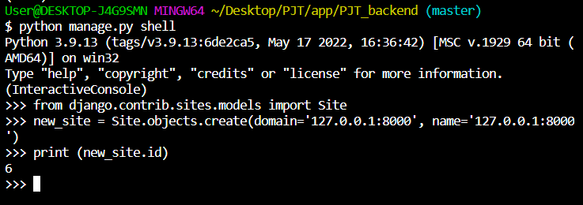
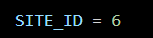

# 프로젝트 drf rest-auth로 소셜로그인
[애플리케이션 등록 보고오기](https://github.com/kimdakyeom/TIL/blob/master/project/1_alcohol_trip/social_login.md)

## settings.py
```python
INSTALLED_APPS = (
    ...,
    'rest_framework',
    'rest_framework.authtoken',
    'rest_auth'
    ...,
    'django.contrib.sites',
    'allauth',
    'allauth.account',
    'rest_auth.registration',
    ...,
    'allauth.socialaccount',
    'allauth.socialaccount.providers.google',
)

SITE_ID = 6
```

## accounts/views.py
```python
from allauth.socialaccount.providers.google.views import GoogleOAuth2Adapter
from allauth.socialaccount.providers.oauth2.client import OAuth2Client
from dj_rest_auth.registration.views import SocialLoginView

class GoogleLogin(SocialLoginView):
    adapter_class = GoogleOAuth2Adapter
    client_class = OAuth2Client
    callback_url = "http://localhost:8000/api/accounts/v1/google/callback/"
```

## accounts/urls.py
```python
from django.urls import path, include
from .views import *

app_name = "accounts"
urlpatterns = [
    path('google/login/finish/', GoogleLogin.as_view(), name='google_login_todjango'),
]
```

## 힘들었던 부분
- 구글 소셜 로그인에 자꾸 리다이렉트 에러가 났다. admain 페이지에 들어가려고 했더니 Site matching query does not exist. 가 났다. DB를 삭제하고 aullauth랑 연동? 하면서 Django가 DB에 갖고 있던 사이트 정보가 사라진 것이 원인이이었다.


- shell 작업을 통해 Site 객체를 다시 DB에 입력했다.


- site_id를 확인하고 해당 번호로 변경하니 구글 소셜 로그인까지 잘 됐다.
## REFERENCE
[django-rest-auth](https://django-rest-auth.readthedocs.io/en/latest/installation.html#social-authentication-optional)