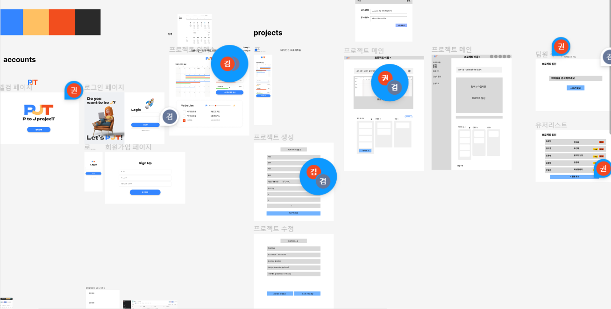

# pjt 프로젝트 기획
## 프로젝트 개요
| 프로젝트 목적 | 웹 프레임워크 DRF와 Vue를 활용한 콘텐츠 기반 커뮤니티 웹 플랫폼 개발 |
| --- | --- |
| 프로젝트 기간 | 11.24 (수) ~ 12.14 (수) |
| 발표 날짜 | 12.15 (목) |
| 팀명 | P 개발자의 J되기 프로젝트  PJT |
| 주제 | 초보 개발자들을 위한 개발 일정 관리 서비스 |
| 팀장 | 김준환 |
| 발표자 | 문재윤 |
| PPT 제작자 | 권세빈, 김유영, 김다겸 |

## 개발 역할 분담
| 이름 | 나이 | 거주지 | MBTI | 희망 분야 | 역할 | 과거 | Git |
| --- | --- | --- | --- | --- | --- | --- | --- |
| 권세빈 | 25 | 경기도 부천시 | INTP | FE  | 창조자 | 커뮤니케이션 디자인 전공 / 올해 졸업 / KDT 바로 시작 | https://github.com/kmk4162 |
| 김유영 | 28 | 인천 청라 | ESTP | BE | 분위기 담당 | 영어영문 전공/ 항공보안 / 카페 매니저 / 어학연수 / KDT 시작 | https://github.com/Pangpyo |
| 김준환 | 25 | 대구 동구 | ISFJ | FE | 완결자 | 전기공학 전공 / 23년 졸업 예정 / 5월부터 개발 시작 | https://github.com/hvvany |
| 김다겸 | 24  | 인천 청라 // 서울 노원구 | ISTP | BE | 추진자 | 정보통신학과 전공 / 22.08 졸업  | https://github.com/choikeunyoung |
| 문재윤 | 23 | 부산시 | ENFP | BE | 자원탐색기 | 군대 전역/  자동차공학재학 | https://github.com/yaonggod|

## 주제 사전 조사 & 분석

[Your work - Jira](https://hvvany.atlassian.net/jira/your-work)

[asana](https://app.asana.com/0/home/1203436208569106)

## 서비스 주요 기능

- 로그인/로그아웃 및 회원가입/회원탈퇴 기능
- 팀원 관리 (팀장만 가능하게)
    - 추가
        - 프로젝트 생성하는 사람(방장)이 유저 이름/이메일을 추가하면 해당 사람은 True 처리
    - 프로젝트 탈퇴
        - False
- 프로젝트 CRUD
    - 마크업 코드 생성 (+복사버튼)
- 달력
- 칸반보드
    - 화살표 버튼 눌러서 스테이터스 변경
    - 자기가 쓴 것만 편집 가능
    - 내것만 보기 / 팀원별로 보기
    - 투두리스트 CRUD
        - 레벨업 기능 (P -> J)
        - 댓글 기능

## 부가 기능

- 실시간 편집
- 인사이트 페이지
- 메시지
- 알림 기능
- 공지 사항 기능
- 투표
- 다크모드
- 마이페이지
    - 내정보 수정
    - 프로필 사진
    - 회원 탈퇴
- 이메일 초대 / 팔로우 초대 / 초대된 사람만 들어올 수 있게
- 칸반보드
    - 드래그 & 드롭
    - 전체 보기
    - 태그별로 필터링해서 볼 수 있음

## 장고 모델(Model) 설계

|엡|모델 이름|역할|
|----|----|----|
|accounts|User|회원정보|
|projects|Project|프로젝트 정보|
|projects|User_Project|User와 Project 사이를 중계할 M:N 중계테이블|
|projects|Todo|프로젝트에서 유저가 해야할 일|
|projects|Comment|Todo에 달리는 댓글|

## 장고 기능(View) 설계

|우선 순위|앱|이름|메소드|요청 URL|
|----|----|----|----|----|
|1|accounts|웰컴 페이지|GET|/accounts/|
|1|accounts|회원가입|POST|/accounts/signup/|
|1|accounts|로그인|POST|/accounts/login/|
|1|accounts|로그아웃|POST|/accounts/logout/|
|1|accounts|회원탈퇴|DELETE|/accounts/delete/|
|1|projects|프로젝트 선택 화면|GET|/|
|1|projects|프로젝트 메인 화면|GET|/foods/<int:project_id>|
|1|projects|프로젝트 생성|POST|/create/|
|1|projects|프로젝트 수정|PUT|/<int:project_id>/update/|
|1|projects|프로젝트 삭제|DELETE|/<int:project_id>/delete/|
|1|projects|md 페이지 요청|GET|/<int:project_id>/markdown|
|2|projects|팀원 추가 화면|POST|/<int:project_id>/members/create|
|2|projects|팀원 목록 화면|GET|/foods/<int:project_id>/members/|
|1|projects|todo 생성|POST|/<int:project_id>/create/<int:todo_id>|
|1|projects|todo 수정|PUT|/<int:project_id>/update/<int:todo_id>|
|1|projects|todo 삭제|DELETE|/<int:project_id/delete/<int:todo_id>|
## 화면 설계

