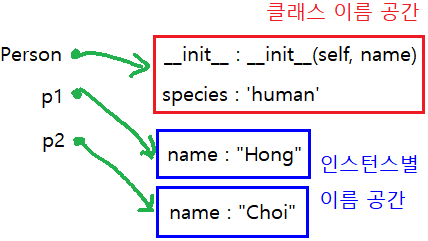

# python 객체지향 프로그래밍
## 클래스
### 클래스 속성(attribute)
- 한 클래스의 모든 인스턴스라도 똑같은 값을 가지고 있는 속성
- 클래스 선언 내부에서 정의
- `classname.name`으로 접근 및 할당
```python
class Cirecle:
    pi = 3.14

c1 = Cirecle()
c2 = Cirecle()

print(Circle.pi) # 3.14
print(c1.pi) # 3.14
print(c2.pi) # 3.14
```
### 인스턴스와 클래스 간의 이름 공간(namespace)
- 클래스를 정의하면 클래스와 해당하는 이름 공간 생성
- 인스턴스를 만들면 인스턴스 객체가 생성되고 이름 공간 생성
- 인스턴스에서 특정 속성에 접근하면 인스턴스-클래스 순으로 탐색
```python
class Person:
    species = 'human'

    def __init__(self, name):
        self.name = name

p1 = Person('Hong')
p2 = Person('Choi')
```

### 클래스 메소드
> 클래스가 사용할 메소드
- @classmethod 데코레이터를 사용하여 정의한다.
- 호출시 첫번째 인자로 클래스(cls)가 전달된다.
```python
class MyClass:

    @classmethod
    def class_method(cls, arg1, …):
```
### 스태틱 메소드
> 인스턴스 변수, 클래스 변수를 전혀 다루지 않는 메소드
- 속성을 다루지 않고 단지 기능(행동)만을 하는 메소드를 정의할 때 사용한다.
- @staticmethod 데코레이터를 사용하여 정의한다.
- 호출시 **어떠한 인자도 전달되지 않는다.** (클래스 정보에 접근/수정 불가)
```python
class MyClass:

    @staticmethod
    def class_method(arg1, …):
```
# 객체지향의 핵심개념
## 추상화 (Abstraction)
> 공통의 속성이나 기능을 묶어 이름을 붙이는 것
>
> OOP에서 클래스를 정의하는 것을 추상화라고 한다.
## 상속성 (Inheritance)
> 상위 개념의 특징을 하위 개념이 물려 받는 것
- 클래스는 상속이 가능하다.
- 모든 파이썬 클래스는 object를 상속 받는다.
- 부모 클래스의 모든 요소(속성, 메소드)가 상속된다.
- `super()`를 통해 부모 클래스의 요소를 호출할 수 있다.
- 메소드 오버라이딩을 통해 자식 클래스에서 재정의가 가능하다.
- 상속관계에서의 이름 공간은 인스턴스, 자식 클래스, 부모 클래스 순으로 탐색한다.
```python
class ChildClass(ParentClass):
    pass
```
### 상속 관련 함수와 메소드
- `issubclass(class, classinfo)`
  - class가 classinfo의 subclass면 True
  - classinfo는 클래스 객체의 튜플일 수 있으며 classinfo의 모든 항목을 검사
- `super()`
  - 자식 클래스에서 부모 클래스를 사용하고 싶은 경우
  ```python
  super().__init__(name, age, number, email)
  # 부모 클래스의 name, age, number, email을 사용
  ```
### 다중 상속
> 두개 이상의 클래스를 상속 받는 경우
- 상속 받은 모든 클래스의 요소를 활용 가능하다.
- 중복된 속성이나 메서드가 있는 경우 상속 순서에 의해 결정된다.
## 다형성(Polymorphism)
> 부모 클래스로부터 물려받은 가상 함수를 자식 클래스 내에서 오버라이딩 하여 사용하는 것
- 동일한 메소드가 클래스에 따라 다르게 행동할 수 있음을 의미한다.
- 서로 다른 클래스에 속해있는 객체들이 동일한 메시지에 대해 다른 방식으로 응답될 수 있다.
### 메소드 오버라이딩
> 상속 받은 메소드를 재정의
- 클래스 상속 시 부모 클래스에서 정의한 메소드를 자식 클래스에서 변경한다.
- 부모 클래스의 메소드 이름과 기본 기능은 그대로 사용하지만 특정 기능을 바꾸고 싶을 때 사용한다.
```python
class Person:
    def __init__(self, name):
        self.name = name

        def talk(self):
            print(f'반갑습니다. {self.name}입니다.')

class Professor(Person): # 상속
    def talk(self):
        # super().talk() 그대로 사용
        print(f'{self.name}일세.') # 메소드 재정의
        
p1 = Professor('김교수')
p1.talk()
# 김교수일세.
```
## 캡슐화 (Encapsulation)
> 변수와 함수를 하나로 묶어서 외부에서의 접근을 막고, 함수를 통해서만 접근 가능하도록 하는 것
- 파이썬에서 기능상으로 존재하지 않지만 관용적으로 사용되는 표현이 있다.
### 접근제어자 종류
-  Public Access Modifier
  - **언더바 없이** 시작하는 메소드나 속성
  - 어디서나 호출이 가능, 하위 클래스 override 허용
- Protected Access Modifier
  - **언더바 1개**로 시작하는 메소드나 속성
  - 암묵적 규칙에 의해 부모 클래스 내부와 자식 클래스에서만 호출 가능
- Private Access Modifier
  - **언더바 2개**로 시작하는 메소드나 속성
  - 본 클래스 내부에서만 사용이 가능