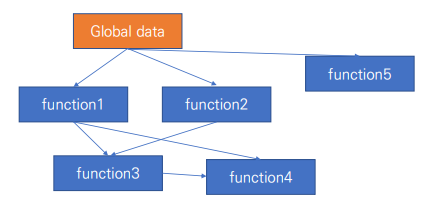
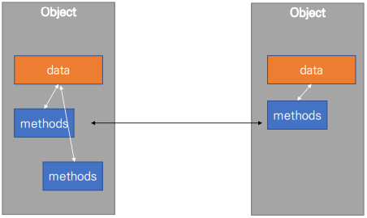

# python 객체지향 프로그래밍
> 객체지향 프로그래밍은 프로그램을 여러 개의 독립된 객체들과 그 객체들 간의 상호작용으로 파악하는 프로그래밍 방법이다.
- 파이썬은 모두 객체(dbject)로 이뤄져있다.
- 객체(object)는 특정 타입의 인스턴스(instance)이다.
- 객체(object)의 특징
  - 타입(type) : 어떤 연산자(operator)와 조작(method)이 가능한가?
  - 속성(attribute) : 어떤 상태(데이터)를 가지는가?
  - 조작법(method) : 어떤 행위(함수)를 할 수 있는가?
## 객체지향 프로그래밍
### 절차지향 프로그래밍 vs 객체지향 프로그래밍
#### 절차지향 프로그래밍
> 데이터와 함수로 인한 변화
>
> 순차적인 처리가 중요시 되며 프로그램 전체가 유기적으로 연결되도록 만드는 프로그래밍 기법


#### 객체지향 프로그래밍
> 데이터와 기능(메소드) 분리, 추상화된 구조(인터페이스)
>
> 실제 세계를 모델링하여 소프트웨어를 개발하는 방법(추상화)


#### 객체지향의 장점
- 객체 지향 프로그래밍은 프로그램을 유연하고 변경이 용이하게 만들기 때문에 대규모
소프트웨어 개발에 많이 사용된다.
-  프로그래밍을 더 배우기 쉽게 하고 소프트웨어 개발과 보수를 간편하게 하며,
보다 직관적인 코드 분석을 가능하게 하는 장점을 가지고 있다.
## OOP 기초
### 기본 문법
> **객체의 틀(클래스)을 가지고, 객체(인스턴스)를 생성한다.**
>
> **ex) 클래스-person, 인스턴스-뷔, 진, 지민**
```python
# 클래스 정의
class MyClass:
pass
# 인스턴스 생성
my_instance = MyClass()
# 메서드 호출
my_instance.my_method()
# 속성
my_instance.my_attribute
```
- 클래스 : 객체들의 분류
- 인스턴스 : 하나하나의 실체/예
  - 파이썬은 모든 것이 객체이며, 모든 객체는 특정 타입의 인스턴스이다.
- 속성 : 특정 데이터 타입/ 클래스의 객체들이 가지게 될 상태/데이터
- 메소드 : 특정 데이터 타입/클래스의 객체에 공통적으로 적용 가능한 행위(함수)
#### 객체 비교하기
- `==`
  - 변수가 참조하는 객체가 동등한(내용이 같은) 경우 `True`
  - 두 객체가 같아 보이지만 실제로 동일한 대상을 가리키고 있다고 확인해 준 것은 아니다.
- `is`
  - 두 변수가 동일한 객체를 가리키는 경우 `True`
#### 인스턴스
```python
class Person:
    def __init__(self, name): # 생성자 메소드
        self.name = name # 인스턴스 변수 정의

john = Person('john') # 인스턴스 변수 접근
print(john.name)
# john
john.name = 'John Kim' # 인스턴스 변수 할당
print(john.name)
# John Kim
```
- 인스턴스 변수
  - 인스턴스가 개인적으로 가지고 있는 속성
  - 각 인스턴스들의 고유한 변수
  - 생성자 메소드에서 `self.name`으로 정의
  - 인스턴스가 생성된 이후 `instance.name`으로 접근 및 할당
- 인스턴스 메소드
  - 인스턴스 변수를 사용하거나 인스턴스 변수에 값을 설정하는 메소드
  - 클래스 내부에 정의되는 메소드의 기본
  - 호출 시, 첫번째 인자로 인스턴스 자기자신(self)이 전달
```python
class MyClass
    def instance_method(self, arg1, ...)
```
- self
  - 인스턴스 자기자신을 뜻한다.
  - 파이썬에서 인스턴스 메소드는 호출 시 첫번째 인자로 인스턴스 자신이 전달되게 설계한다.
    - 매개변수 이름으로 self를 첫번째 인자로 정의한다.
    - 다른 단어로 써도 작동하지만 파이썬의 암묵적인 규칙이다.
- 생성자(constructor) 메소드
  - 인스턴스 객체가 생성될 때 자동으로 호출되는 메소드
  - 인스턴스 변수들의 초기값을 설정
- 소멸자(destructor) 메소드
  - 인스턴스 객체가 소멸(파괴)되기 직전에 호출되는 메소드
```python
class Person:
    def __del__(self):
        print('인스턴스 사라짐')

person = Person()
del person
# 인스턴스 사라짐
```