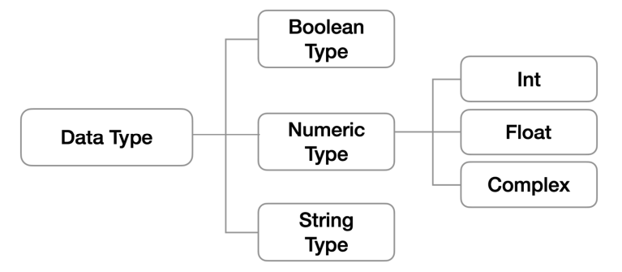

# python

> 다른 프로그래밍 언어보다 문법이 간단하면서도 엄격하지 않다.
>
> 같은 작업에 대해서도 C나 자바로 작성할 때보다 더 간결하게 작성 가능하다.
>
> 다양한 운영체제에서 실행이 가능하다.

## python의 특징

- 인터프리터 언어(Interpreter)
  - 소스코드를 기계어로 변환하는 컴파일 과정 없이 바로 실행 가능하다.
  - 코드를 대화하듯 한 줄 입력하고 실행한 후, 바로 확인할 수 있다.
- 객체 지향 프로그래밍(Object Oriented Programming)
  - 모든 것이 객체로 구현되어 있다.
    - 객체(object) : 숫자, 문자, 클래스 등 값을 가지고 있는 모든 것(things ~것)

## 기초 문법

### 들여쓰기(Identation)

- Space Sensitive
  - 문장을 구분할 때, 4스페이스 혹은 1탭을 입력하여 들여쓰기를 사용한다.

### 변수(Variable)

> 컴퓨터 메모리 어딘가에 저장되어 있는 객체를 참조하기 위해 사용되는 이름
>
> 동일 변수에 다른 객체를 언제든 할당할 수 있기 때문에, 즉 참조하는 객체가 바뀔수 있기 때문에 '변수'라고 불린다.

- 변수는 할당 연산자(=)를 통해 값을 할당(assignment)한다.

- `type()`
  - 변수에 할당된 값의 타입
  
- `id()`
  - 변수에 할당된 값(객체)의 고유한 identity 값이며, 메모리주소이다.
  
- 변수 할당
  - 같은 값을 동시에 할당할 수 있다.
  
    ```python
    x = y = 1004
    print(x, y)
    # 1004 1004
    ```
  
  - 다른 값을 동시에 할당 할 수 있다.
  
    ```python
    x, y = 1, 2
    print(x, y)
    # 1 2
    ```

### 식별자(Identifiers)

> 파이썬 객체(변수, 함수, 모듈, 클래스 등)를 식별하는데 사용하는 이름

- 규칙
  - 식별자의 이름은 영문 알파벳, 언더스코어(_), 숫자로 구성한다.
  - 첫 글자에 숫자가 올 수 없다.
  - 길이제한이 없고, 대소문자를 구별한다.
  - 다음의 키워드는 예약어로 사용할 수 없다.
  | False, None, True, and, as, assert, async, await, break, class, continue, def, del, elif, else, except, finally, for, from, global, if, import, in, is, lambda, nonlocal, not, or, pass, raise, return, try, while, with, yield |
  | ------------------------------------------------------------ |

  - 내장함수나 모듈 등의 이름으로도 만들면 안된다.


### 사용자 입력

- input([프롬포트에 나타낼 내용])
  - 사용자로부터 값을 즉시 입력받을 수 있는 내장함수
  
  - 대괄호 부분에 문자열을 넣으면 입력 시, 해당 문자열을 출력할 수 있다.
  
  - **반환값은 항상 문자열의 형태로 반환된다.**
  
    ```python
    name = input('이름을 입력해주세요 : ')
    print(name)
    # 이름을 입력해주세요 : 파이썬
    type(name)
    # str
    ```

### 주석(Comment)

> 코드에 대한 설명
>
> 중요한 점이나 다시 확인하여야 하는 부분들을 표시한다.
>
> 컴퓨터는 주석을 인식하지 않고, 사용자만을 위한 것이다.
> 
> 개발자에게 주석 작성 습관은 매우 중요하다.

- 한 줄 주석
  - 주석으로 처리될 내용 앞에 '#'을 입력한다.

  ```python
  # 주석(comment)입니다.
  # print('hello')
  print('world’) # 주석
  ```

## 파이썬 기본 자료형(Python Datatype)



###  자료형 분류

#### 불린형(Boolean Type)

> True/False 값을 가진 타입
>
> 비교/논리 연산을 수행할 때 사용된다.
>
> 다음은 모두 False로 변환 -> 0, 0.0, (), [], {}, '', None

- 논리 연산자(Logical Operator)
  - and : 모두 참인 경우 참, 그렇지 않으면 거짓
  - or : 둘 중 하나만 참이라도 참, 그렇지 않으면 거짓
  - not : 참 거짓의 반대의 결과
- `bool()` 함수
  - 특정 데이터가 True인지 False인지 검증

```python
bool(0) # False
bool('') # False
bool(1) # True
bool([]) # False
bool(-1) # True (0이 아닌 모든 수는 True)
bool([1,2,3]) # True
```

#### 수치형(Numeric Type)


  - 정수(Int)

      - 모든 정수의 타입은 int이다.
      - 매우 큰 수를 나타낼 때 오버플로우가 발생하지 않는다.


  - 실수(Float)

      - 정수가 아닌 모든 실수는 float타입니다.
      - 부동소수점 실수 연산 과정에서 Floating point rounding error 발생이 가능하다.
        -  abs(a-b) <= 1e-10 사용


  - complex(복소수, complex number)

    - 실수부와 허수부로 구성된 복소수는 모두 complex 타입

  - 산술 연산자(Arithmetic Operator)


  | 연산자 | 내용     |
  | ------ | -------- |
  | +      | 덧셈     |
  | -      | 뺄셈     |
  | *      | 곱셈     |
  | %      | 나머지   |
  | /      | 나눗셈   |
  | //     | 몫       |
  | **     | 거듭제곱 |

   - 비교 연산자(Comparison Operator)
| 연산자 | 내용                        |
| ------ | --------------------------- |
| <      | 미만                        |
| <=     | 이하                        |
| >      | 초과                        |
| >=     | 이상                        |
| ==     | 같음                        |
| !=     | 같지않음                    |
| is     | 객체 아이덴티티(OOP)        |
| is not | 객체 아이덴티티가 아닌 경우 |

#### 문자열(String Type)

> 모든 문자는 str 타입이다.
>
> 문자열은 작은 따옴표(')나 큰 따옴표(")를 활용하여 표기한다.

- 중첩따옴표(Nested Quotes)
  - 따옴표 안에 따옴표를 표현할 경우

  ```python
  print("문자열 안에 '작은 따옴표'를 사용하려면 큰 따옴표로 묶는다.")
  print('문자열 안에 "큰 따옴표"를 사용하려면 작은 따옴표로 묶는다.')
  ```


- 인덱싱

  > 인덱스를 통해 특정 값에 접근할 수 있다.
  
  - 문자열 슬라이싱(Slicing)
  
    |       | a    | b    | c    | d    | e    | f    | g    | h    | i    |
    | ----- | ---- | ---- | ---- | ---- | ---- | ---- | ---- | ---- | ---- |
    | index | 0    | 1    | 2    | 3    | 4    | 5    | 6    | 7    | 8    |
  
    ```python
    s[1] # b
    s[2:5] # cde 인덱스 2이상 5미만
    s[2:5:2] # ce 인덱스 2이상 5미만 2개씩 스텝
    s[5:2:-1] # fed 인덱스 5이하 2초과 반대로
    s[:3] # abc 인덱스 처음부터 3미만
    s[5:] # fghi 인덱스 5이상 마지막까지
    s[::] # abcdefghi 전체
    s[::-1] # ihgfedcba 전체 반대로
    ```
  

- 기타

  - 결합(Concatenation)

    ```python
    'hello, ' + 'python!'
    # 'hello, python!'
    ```

  - 반복(Repetition)

    ```python
    'hi!' * 3
    # 'hi!hi!hi!'
    ```

  - 포함(Membership)

    ```python
    'a' in 'apple'
    # True
    'app' in 'apple'
    # True
    'b' in 'apple'
    # False
    ```

- Escape sequence

  - 문자열 내에서 특정 문자나 조작을 위해 역슬래시(\\\)를 활용하여 구분

    | 예약문자 | 내용(의미)      |
    | -------- | --------------- |
    | \n       | 줄 바꿈         |
    | \t       | 탭              |
    | \r       | 캐리지리턴      |
    | \0       | 널(Null)        |
    | \\\      | \               |
    | \\'      | 단일인용부호(') |
    | \\"      | 이중인용부호(") |


- String Interpolation

  - 문자열을 변수를 활용하여 만드는 법

    - `%-formatting`

      ```python
      name = 'Kim'
      score = 4.5
      print('Hello, %s' % name)
      print('내 성적은 %d' % score)
      print('내 성적은 %f' % score)
      # Hello, Kim
      # 내 성적은 4
      # 내 성적은 4.500000
      ```

    - `f-string` (이 방법이 더 편하다!)

      ```python
      name = 'Kim'
      score = 4.5
      print(f'Hello, {name}! 성적은 {score}')
      # Hello, Kim! 성적은 4.5
      pi = 3.141592
      print(f'원주율은 {pi:.3}. 반지름이 2일때 원의 넓이는 {pi*2*2}')
      # '원주율은 3.14. 반지름이 2일때 원의 넓이는 12.566368'
      ```

- 문자열 특징
  - Immutable : 변경이 불가능하다.
  - Iterable : 반복이 가능하다.

#### None

- 값이 없다.
- 일반적으로 반환 값이 없는 함수에서 사용하기도 한다.

## 형 변환(Typecasting)

> 파이썬에서 데이터 형태는 서로 변환할 수 있다.

- 암시적 형 변환(Implicit Typecasting)

  - 사용자가 의도하지 않고, 파이썬 내부적으로 자료형을 변환하는 경우

    - bool, Numeric type(int, float, complex)

      ```python
      True + 3
      # 4
      3 + 5.0
      # 8.0
      3 + 4j + 5
      # (8+4j)
      ```

- 명시적 형 변환(Explicit Typecasting)
  - str, float -> int
  - str, int -> float
  - int, float, list, tuple, dict -> str

## 컨테이너(Container)

> 컨테이너란?
>
> 여러 개의 값을 담을 수 있는 것(객체)으로, 서로 다른 자료형을 저장할 수 있다.

- 컨테이너 분류
  - 시퀀스
    - 문자열(immutable) : 문자들의 나열
    - 리스트(mutable) : 변경 가능한 값들의 나열
    - 튜플(immutable) : 변경 불가능한 값들의 나열
    - 레인지(immutable) : 숫자의 나열
  - 컬렉션/비시퀀스
    - 세트(mutable) : 유일한 값들의 모음
    - 딕셔너리(mutable) : 키-값들의 모음

- 시퀀스형 컨테이너

  - 리스트(List)

    > 변경 가능한 값들의 나열된 자료형
    >
    > 순서를 가지며, 서로 다른 타입의 요소를 가질 수 있다.
    >
    > 변경 가능하며(mutable), 반복 가능하다(iterable).
    >
    > 항상 대괄호 형태로 정의하며, 요소는 콤마로 구분한다. - > [0, 1, 2, 3, 4, 5]

    - 리스트 생성

      ```python
      # 생성
      my_list = []
      another_list = list()
      type(my_list)
      # <class 'list'>
      type(another_list)
      # <class 'list'>
      ```

    - 리스트 접근과 변경

      ```python
      # 값 접근
      a = [1, 2, 3]
      print(a[0])
      # 1
      # 값 변경
      a[0] = '1'
      print(a)
      # ['1', 2, 3]
      ```

    - 리스트 값 추가/삭제

      ```python
      # 값 추가
      even_numbers = [2, 4, 6, 8]
      even_numbers.append(10)
      even_numbers
      # => [2, 4, 6, 8, 10]
      # 값 삭제
      even_numbers = [2, 4, 6, 8]
      even_numbers.pop(0)
      even_numbers
      # => [4, 6, 8]
      ```

  - 튜플(Tuple)

    > 불변한 값들의 나열
    >
    > 순서를 가지며, 서로 다른 타입의 요소를 가질 수 있다.
    >
    > 변경 불가능하며(immutable), 반복 가능하다(iterable).
    >
    > 항상 소괄호 형태로 정의하며, 요소는 콤마로 구분한다. -> (0, 1, 3)

    - 생성과 접근

      ```python
      # 값 생성 및 접근
      a = (1, 2, 3, 1)
      a[1]
      # 값 변경/추가/삭제 => 불가능
      a[1] = ‘3’
      ```

  - 레인지(Range)

    > 숫자의 시퀀스를 나타내기 위해 사용한다.
    >
    > - range(n) : 0부터 n-1까지의 숫자 시퀀스
    > - range(n, m) : n부터 m-1까지의 숫자 시퀀스
    > - range(n, m, s) : n부터 m-1까지 s만큼 증가시키며 숫자 시퀀스
    >
    > 변경 불가능하며(immutable), 반복 가능하다(iterable).
    >
    > range(n=0, m, s=1)

    - 예시

      ```python
      # 0부터 특정 숫자까지
      list(range(3))
      # [0, 1, 2]
      # 숫자의 범위
      list(range(1, 5))
      # [1, 2, 3, 4]
      # step 활용
      list(range(1, 5, 2))
      # [1, 3]
      ```

- 비시퀀스형 컨테이너

  - 세트(Set)

    > 유일한 값들의 모음
    >
    > 순서가 없고 중복된 값이 없다.
    >
    > 변경 가능하며(mutable), 반복이 가능하다(iterable).

    - 세트 생성

      ```python
      # 세트 생성
      {1, 2, 3, 1, 2}
      # {1, 2, 3}
      type({1, 2, 3})
      # <class 'set'>
      blank_set = set()
      ```

    - 세트 추가/삭제

      ```python
      # 세트 추가
      numbers = {1, 2, 3}
      numbers.add(5)
      numbers
      # => {1, 2, 3, 5}
      numbers.add(1)
      numbers
      # => {1, 2, 3, 5}
      # 세트 삭제
      numbers = {1, 2, 3}
      numbers.remove(1)
      numbers
      # => {2, 3}
      ```

  - 딕셔너리(Dictionary)

    > 키-값(key-value) 쌍으로 이뤄진 모음
    >
    > 변경 가능하며(mutable), 반복이 가능하다(iterable).
    >
    > 키와 값은 **:**로 구분, 개별 요소는 **,**로 구분 -> {key1 : value1, key2 : value2}

    - 딕셔너리 생성

      ```python
      students = {'홍길동': 30, '김철수': 25}
      # key : string, integer, float, boolean, tuple, range 만 활용 가능
      # value : 모든 값 설정 가능
      ```

    - 딕셔너리 접근

      ```python
      movie = {
      'title': '설국열차',
      'genres': ['SF', '액션', '드라마'],
      'open_date': '2013-08-01',
      'time': 126,
      'adult': False,
      }
      movie['genres']
      # ['SF', '액션', '드라마']
      ```

    - 딕셔너리 키-값 추가 및 변경

      ```python
      students = {'홍길동': 100, '김철수': 90}
      students['홍길동'] = 80
      # {'홍길동': 80, '김철수': 90}
      students['박영희'] = 95
      # {'홍길동': 80, '김철수': 90, '박영희': 95}
      # 이미 해당하는 키가 있다면 기존 값이 변경
      ```

    - 딕셔너리 키-값 삭제

      ```python
      students = {'홍길동': 30, '김철수': 25}
      students.pop('홍길동')
      students
      # {'김철수': 25}
      # key가 없는 경우는 KeyError 발생
      ```

      
