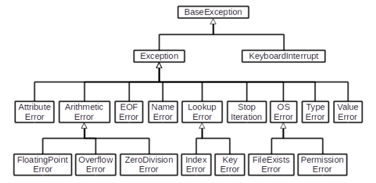

# python 에러/예외처리
## 디버깅
- print 함수 활용
- 개발환경에서 제공하는 기능 활용
- python tutor 활용
- 뇌컴파일, 눈디버깅
## 에러와 예외
### 문법 에러(Syntax Error)
> SyntaxError가 발생하면 파이썬 프로그램은 실행되지 않는다.
>
> 파일이름, 줄번호, ^문자를 통해 파이썬이 코드를 읽어 나갈 때 문제가 발생한 위치를 표현한다.
>
> 줄에서 에러가 감지된 가장 앞의 위치를 가리키는 캐럿 기호(^)를 표시한다.
- EOL(End of Line)
  ```python
  print('hello
  ```
- EOF(End of File)
  ```python
  print(
  ```
- Invalid syntax
  ```python
  while
  ```
- assign to literal
  ```python
  5 = 3
  ```
### 예외(Exception)
> 실행 도중 예상치 못한 상황을 맞이하면 프로그램 실행을 멈춘다
>
>실행 중에 감지되는 에러들을 예외라고 한다.
>
> 예외는 여러 타입으로 나타나고, 타입이 메시지의 일부로 출력된다.
>
> 모든 내장 예외는 Exception Class를 상속받아 이뤄진다.
>
> 사용자 정의 예외를 만들어 관리할 수 있다.
- ZeroDivisionError : 0으로 나눌 때 발생
- NameError : namespace 상에 이름이 없는 경우 발생
- TypeError : 타입이 불일치할 때 발생
- ValueError : 타입은 올바르나 값이 적절하지 않거나 없는 경우 발생
- IndexError : index 범위를 벗어났을 경우 발생
- KeyError : key가 다를 경우 발생
- ModuleNotFoundError : 존재하지 않는 모듈을 import 하는 경우 발생
- ImportError : 모듈은 있으나 존재하지 않는 클래스/함수를 가져오는 경우 발생
- IndentationError : Indentation이 적절하지 않는 경우
- KeyboardInterrupt : 임의로 프로그램을 종료하였을 때

### 예외처리
> try문(statement) / excep절(clause)을 이용하여 예외 처리를 할 수 있다.
- try문
  - 오류가 발생할 가능성 있는 코드 실행
  - 예외가 발생되지 않으면 except 없이 실행 종료
- except문
  - 예외가 발생하면 except절 실행
  - 예외 상황을 처리하는 코드를 받아서 적절한 조취를 취함
```python
try:
    try 명령문
except 예외그룹-1 as 변수-1 :
    예외처리 명령문 1
except 예외그룹-2 as 변수-2 :
    예외처리 명령문 2
finally:
    finally명령문
```
- try : 코드를 실행한다.
- except : try문에서 예외가 발생시에 실행한다.
- else : try문에서 예외가 발생하지 않으면 실행한다.
- finally : 예외 발생 여부와 관계없이 항상 실행한다.
### 예외 발생 시키기
> raise를 통해 예외를 강제로 발생시킨다.
```python
raise <표현식>(메시지)
```