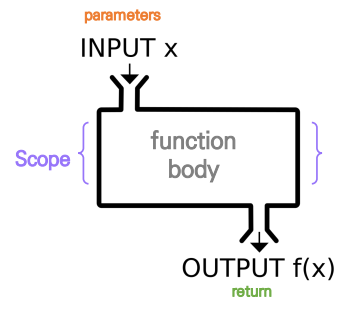
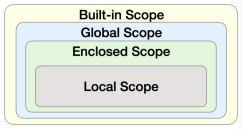

# python 함수

> 함수(Function)란?
>
> 특정한 기능을 하는 코드의 조각(묶음)
>
> 특정 명령을 수행하는 코드를 매번 다시 작성하지 않고, 필요 시에만 호출하여 간편히 사용

## 함수 기초

### 사용자 함수(Custom Function) 

> 구현되어 있는 함수가 없는 경우, 사용자가 직접 함수를 작성 가능하다.

```python
def function_name
	# code block
    return returning_value
```

### 내장함수(Built-in Function)

```python
import math
values = [100, 75, 85, 90, 65, 95]
mean = sum(values) / len(values)
sum_var = sum(pow(value - mean, 2) for value in values) / len(values)
std_dev = math.sqrt(sum_var)
print(std_dev)
```

### pstdev 함수(파이썬 표준 라이브러리 - statistics)

```python
import statistics
values = [100, 75, 85, 90, 65, 95]
statistics.pstdev(values)
```

### 함수를 사용하는 이유

- 코드가 중복되는 것을 방지한다.
- 재사용이 용이하다.

### 함수 기본 구조 



#### 선언

- 함수의 선언은 def 키워드를 활용한다.
- 들여쓰기를 통해 Fuction body를 작성한다.
- 함수는 parameter를 넘겨줄 수 있다.
- 함수는 동작 후에 return을 통해 결과값을 전달한다.

#### 호출

- 함수는 함수명()으로 호출한다

  ```python
  # 선언
  def foo():
      return True
  # 호출
  foo()
  # 선언
  def add(x, y):
      return x + y
  # 호출
  add(2, 3)
  ```

## 함수의 결과값(Output)

- 함수는 반드시 **값을 하나만 return**한다.
  - 명시적인 return이 없는 경우에도 None을 반환한다.
  - 여러 파라미터를 반환할 때는 하나의 튜플로 반환한다.
- 함수는 return과 동시에 실행이 종료된다.

```python
def minus_and_product(x, y):
return x - y, x * y
```

```python
minus_and_product(4, 5)
# (-1, 20)
```

## 함수의 입력(Input)

### Parameter vs Argument

- `Parameter` : 함수를 실행할 때, 함수 내부에서 사용되는 식별자
- `Argument` : 함수를 호출할 때, 넣어주는 값

```python
def fuction(ham): # ham : parameter
    return ham
```

```python
fuction('spam') # spam : argument
```

#### Argument

> 함수 호출 시 함수의 parameter를 통해 전달되는 값
>
> 소괄호 안에 할당한다.

- positional arguments 

  - 기본적으로 함수 호출 시 argument는 위치에 따라 함수 내에 전달된다.

    ```python
    def add(x, y):
        return x + y
    ```

    ```python
    add(2, 3)
    ```

- keyword arguments

  - 직접 변수의 이름으로 특정 argument를 전달할 수 있다.

  - keyword arguments 다음에 positional arguments를 활용할 수 없다.

    ```python
    def add(x, y):
        return x + y
    ```

    ```python
    add(x=2, y=5)
    add(x, y=5)
    # add(x=2, y) 불가❌❌❌
    ```

- default arguments values

  - 기본값을 지정하여 함수 호출 시 argument 값을 설정하지 않도록 한다.

  - 정의된 것보다 더 적은 개수의 argument들로 호출될 수 있다.

    ```python
    def add(x, y=0):
        return x + y
    ```

    ```python
    add(2) # y=0
    add(2, 5)
    ```

- 정해지지 않은 개수의 arguments

  - 여러 개의 positional arguments를 하나의 필수 parameter로 받아서 사용한다.

  - 몇 개의 positional arguments를 받을지 모르는 함수를 정의할 때 유용하다.

  - argument들은 **튜플**로 묶여 처리되며, parameter에 `*`를 붙여서 표현한다.

    ```python
    def add(*args):
    for arg in args:
    print(arg)
    ```

    ```python
    add(2)
    add(2, 3, 4, 5)
    ```

- 정해지지 않은 개수의 keyword arguments

  - 함수가 임의의 개수 argument를 keyword argument로 호출될 수 있도록 지정한다.

  - argument들은 **딕셔너리**로 묶여 처리되며, parameter에 `**`를 붙여서 표현한다.

    ```python
    def family(**kwargs):
    for key, value in kwargs:
    print(key, ":", value)
    ```

    ```python
    family(father='John', mother='Jane', me='John Jr.')
    ```

## 함수의 범위(Scope)

> 함수는 코드 내부에 local scope를 생성하며, 그 외의 공간인 global scope로 구분

- 함수의 scope

  - scope
    - global scope : 코드 어디에서든 참조할 수 있는 공간
    - local scope : 함수가 만든 scope. 함수 내부에서만 참조 가능

  - variable
    - global variable : global scope에 정의된 변수
    - local variable : local scope에 정의된 변수

- 객체 수명주기

  - built-in scope : 파이썬이 실행된 이후부터 영원히 유지
  - global scope : 모듈이 호출된 시점 이후 혹은 인터프리터가 끝날 때까지 유지
  - local scope : 함수가 호출될 때 생성되고, 함수가 종료될 때까지 유지

- 이름 검색 규칙
  - 파이썬에서 사용되는 이름(식별자)들은 이름 공간에 저장되어 있다.
  - 함수 내에서는 바깥 Scope의 변수에 접근이 가능하지만 수정은 할 수 없다.
  - LEGB Rule
    - Local scope : 함수
    - Enclosed scope : 특정 함수의 상위 함수
    - Global scope : 함수 밖의 변수, Import 모듈
    - Built-in scope : 파이썬 안에 내장되어 있는 함수 또는 속성



## 함수 응용

- 내장 함수 응용
  - 파이썬 인터프리터에는 사용할 수 있는 많은 함수와 type이 내장되어 있다.
  - [파이썬 공식 문서 참조](https://docs.python.org/3/)

- map

  - 순회 가능한 데이터구조의 모든 요소에 함수를 적용하고, 그 결과를 map object로 반환한다.

    ```python
    numbers = [1, 2, 3]
    result = map(str, numbers)
    print(result, type(result))
    ```

  - 알고리즘 문제 풀이시 input 값들을 숫자로 바로 활용하고 싶을 때 사용한다.

    ```python
    n, m = map(int, input().split())
    ```

    