# Bootstrap
## CDN으로 Bootstrap 시작하기
> CDN(Content Delivery(Distribution) Network)
>
> 컨텐츠(CSS, JS, Image, Text 등)을 효율적으로 전달하기 위해
여러 노드에 가진 네트워크에 데이터를 제공하는 시스템
> 
> 개별 end-user의 가까운 서버를 통해 빠르게 전달 가능(지리적 이점)
>
> 외부 서버를 활용함으로써 본인 서버의 부하가 적어짐

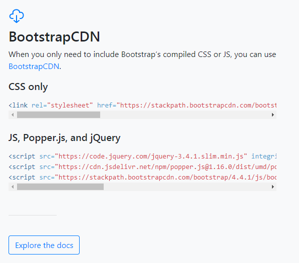

- 위의 코드들을 그대로 html에 포함시키면 Bootstrap 사용 준비 끝

## Layout
### Breakpoints
> 중단점(Breakpoints)란?
>
> 장치 또는 뷰포트 크기에 따라 레이아웃 응답이 어떻게 변경되는지에 대한 부트스트랩의 트리거

|Breakpoint|Class infix|Dimensions|
| ---- | ---- | ---- |
|Extra small|None|<576px|
|Small|sm|≥576px|
|Medium|md|≥768px|
|Large|lg|≥992px|
|Extra large|xl|≥1200px|
|Extra extra large|xxl|≥1400px|

- small(sm) : 스마트폰
- medium(md) : 태블릿
- large(lg) : 태블릿

## Content
### Typography
#### Inline text elements
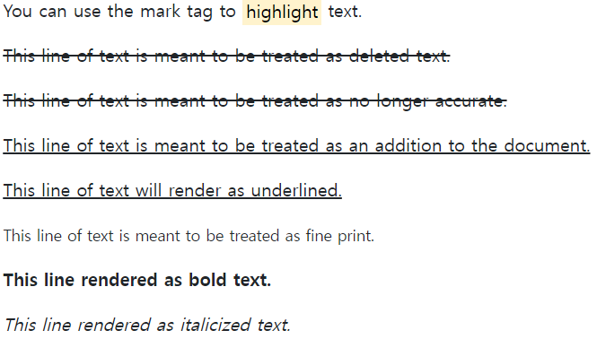

```html
<p>You can use the mark tag to <mark>highlight</mark> text.</p>
<p><del>This line of text is meant to be treated as deleted text.</del></p>
<p><s>This line of text is meant to be treated as no longer accurate.</s></p>
<p><ins>This line of text is meant to be treated as an addition to the document.</ins></p>
<p><u>This line of text will render as underlined.</u></p>
<p><small>This line of text is meant to be treated as fine print.</small></p>
<p><strong>This line rendered as bold text.</strong></p>
<p><em>This line rendered as italicized text.</em></p>
```

#### Alignment
```html
// 텍스트 가운데 정렬
.text-center

// 텍스트 오른쪽 정렬
.text-end
```

### Images
```html
// 반응형 이미지
.img-fluid

// 이미지 축소판 200*200
.img-thumbnail

// 이미지 왼쪽 정렬
.float-start

// 이미지 오른쪽 정렬
.float-end
```

### Tables
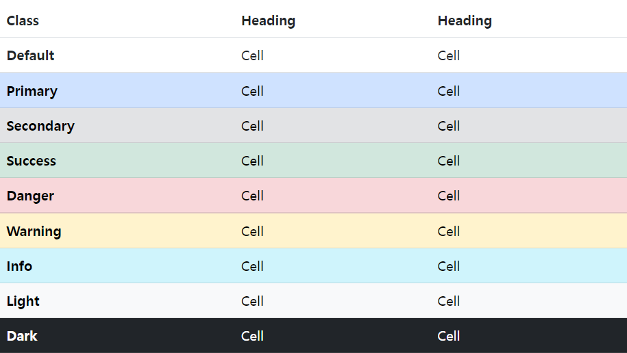
- `<table>`, `<tr>`, `<td>` 에 사용 가능

```html
// table의 row에 줄무늬
.table-striped

// table의 column에 줄무늬
.table-striped-columns

// 마우스 오버시
.table-hover

// 행이나 셀에 하이라이트
.table-active

// 테이블에 border
.table-bordered

// 테이블에 border 없애기
.table-borderless

// 그룹 구분선
.table-group-divider
```

## Forms
### Sizing
```html
// form 크게
.form-control-lg

// form 작게
.form-control-sm
```
### Disabled
```html
// form 비활성화
.disabled
```

### Color
```html
// Color Picker
<input type="color" class="form-control form-control-color" id="exampleColorInput" value="#563d7c" title="Choose your color">
```

### Select
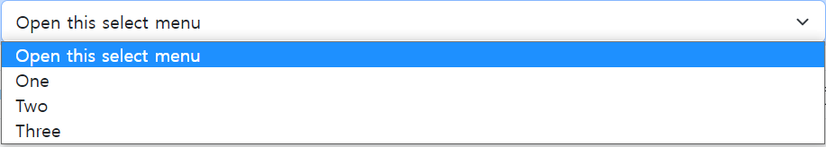
```html
<select class="form-select" aria-label="Default select example">
  <option selected>Open this select menu</option>
  <option value="1">One</option>
  <option value="2">Two</option>
  <option value="3">Three</option>
</select>
```

#### Sizing
```html
// select 크기 크게
.form-select-lg

// select 크기 작게
.form-select-sm
```

#### Disabled 
```html
// select 비활성화
.disabled
```

#### Checks and radios
- Checks

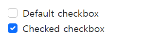
```html
<div class="form-check">
  <input class="form-check-input" type="checkbox" value="" id="flexCheckDefault">
  <label class="form-check-label" for="flexCheckDefault">
    Default checkbox
  </label>
</div>
<div class="form-check">
  <input class="form-check-input" type="checkbox" value="" id="flexCheckChecked" checked>
  <label class="form-check-label" for="flexCheckChecked">
    Checked checkbox
  </label>
</div>
```

-Radios

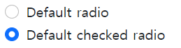
```html
<div class="form-check">
  <input class="form-check-input" type="radio" name="flexRadioDefault" id="flexRadioDefault1">
  <label class="form-check-label" for="flexRadioDefault1">
    Default radio
  </label>
</div>
<div class="form-check">
  <input class="form-check-input" type="radio" name="flexRadioDefault" id="flexRadioDefault2" checked>
  <label class="form-check-label" for="flexRadioDefault2">
    Default checked radio
  </label>
</div>
```
```html
// 기본값
.form-check

// 비활성화
.disabled

// inline
.form-check-inline
```

## Utilities
### Colors
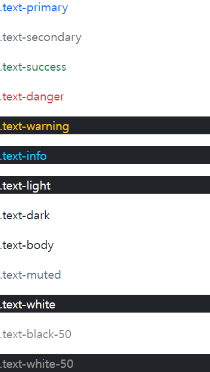
### Display
```html
// 양 옆으로 배치
.d-inline

// 위 아래로 배치
.d-block
```

#### 반응형 요소 숨기기
|Screen size|Class|
| ---- | ---- |
|Hidden on all|.d-none|
|Hidden only on xs|.d-none .d-sm-block|
|Hidden only on sm|	.d-sm-none .d-md-block|
|Hidden only on md|.d-md-none .d-lg-block|
|Hidden only on lg|	.d-lg-none .d-xl-block|
|Hidden only on xl|.d-xl-none|
|Hidden only on xxl|.d-xxl-none .d-xxl-block|
|Visible on all|.d-block|
|Visible only on xs|.d-block .d-sm-none|
|Visible only on sm|.d-none .d-sm-block .d-md-none|
|Visible only on md|.d-none .d-md-block .d-lg-none|
|Visible only on lg|.d-none .d-lg-block .d-xl-none|
|Visible only on xl|.d-none .d-xl-block .d-xxl-none|
|Visible only on xxl|.d-none .d-xxl-block|

### Flex
#### Enable flex behaviors
```html
// display: flex;
.d-flex
.d-inline-flex
 
// 반응형
.d-sm-inline-flex
.d-xxl-inline-flex
```

#### Direction
```html
// flex-direction
.flex-row
.flex-row-reverse
.flex-column
.flex-column-reverse
 
// 반응형
.flex-sm-row
.flex-md-column
```

#### Justify content
```html
/ 가로 정렬
.justify-content-start
.justify-content-end
.justify-content-center
.justify-content-between
.justify-content-around
.justify-content-evenly
 
// 세로 정렬
.align-content-start
.align-content-end
.align-content-center
.align-content-around
.align-content-stretch
```

#### Align items
```html
// 한줄 세로 정렬
.align-items-start
.align-items-end
.align-items-center
.align-items-baseline
.align-items-stretch
 
// 아이템 하나 세로 정렬
.align-self-start
.align-self-end
.align-self-center
.align-self-baseline
.align-self-stretch
```

#### Fill
- 사용 가능한 모든 가로 공간을 차지하면서 콘텐츠와 동일한 너비 (또는 콘텐츠가 테두리 상자를 초과하지 않는 너비)로 강제 설정
```html
.flex-fill
```

#### Auto margins
```html
// 항목을 오른쪽으로 밀기
.me-auto

// 항목을 왼쪽으로 밀기
.ms-auto
```

#### Wrap
```html
// flex-wrap
.flex-wrap
.flex-nowrap
.flex-wrap-reverse
```

#### Order
```html
// 숫자로 순서 지정
.order-0 ~ 5
 
// 각각 order : -1, order : 6 과 같다
.order-first
.order-last
```

#### Align content 
```html
// 왼쪽부터
.align-content-start

// 아래부터
.align-content-end

// 가운데로
.align-content-center

.align-content-between
.align-content-around
.align-content-stretch
```
- `align-content-between`

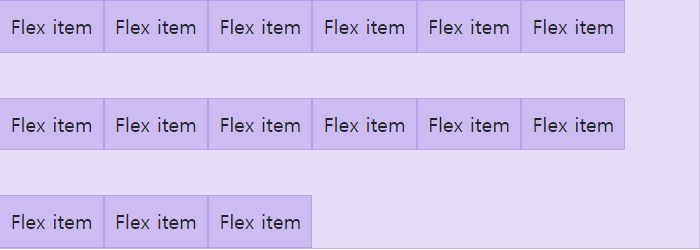

- `align-content-around`

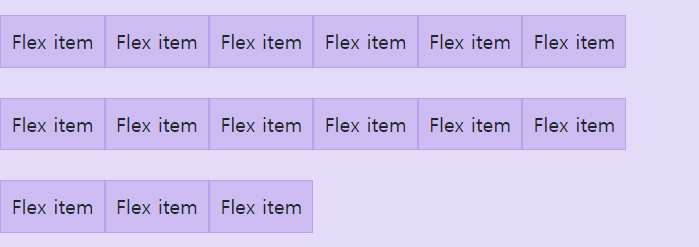

- `align-content-stretch`

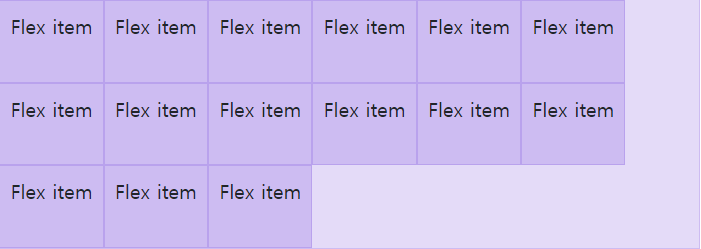

### Float
```html
.float-start, end, none

// 반응형
.float-sm-start, ...
```

### Interations
```html
// 클릭 이벤트 방지
.pe-none
.pe-auto
```

### Opacity
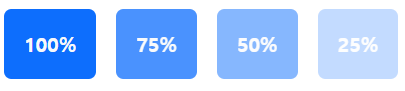
```html
.opacity-{value}
```

### Overflow
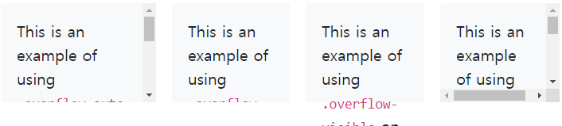
```html
.overflow-auto
.overflow-hidden
.overflow-visible
.overflow-scroll
```

### Position
```html
// position : 속성
position-static
position-relative
position-absolute
position-fixed
position-stick
```

#### Arrange elemements
- property
  - `top` - for the vertical top position
  - `start` - for the horizontal left position (in LTR)
  - `bottom` - for the vertical bottom position
  - `end` - for the horizontal right position (in LTR)

- position
  - `0` - for 0 edge position
  - `50` - for 50% edge position
  - `100` - for 100% edge position

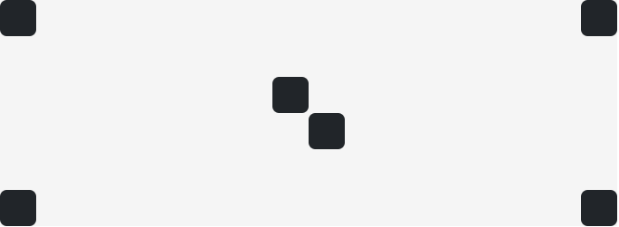

```html
<div class="position-relative">
  <div class="position-absolute top-0 start-0"></div>
  <div class="position-absolute top-0 end-0"></div>
  <div class="position-absolute top-50 start-50"></div>
  <div class="position-absolute bottom-50 end-50"></div>
  <div class="position-absolute bottom-0 start-0"></div>
  <div class="position-absolute bottom-0 end-0"></div>
</div>
```

#### Translate
- top-50 start-50 으로 하면 중앙에서 살짝 어긋나기 때문에 translate 클래스로 정확히 중앙으로 정렬
```html
// 요소 중앙 배치
.translate-middle
 
// 요소를 가로 또는 세로 방향으로 중앙 배치
.translate-middle-x
.translate-middle-y
```


```html
<div class="position-relative">
  <div class="position-absolute top-0 start-0"></div>
  <div class="position-absolute top-0 start-50 translate-middle-x"></div>
  <div class="position-absolute top-0 end-0"></div>
  <div class="position-absolute top-50 start-0 translate-middle-y"></div>
  <div class="position-absolute top-50 start-50 translate-middle"></div>
  <div class="position-absolute top-50 end-0 translate-middle-y"></div>
  <div class="position-absolute bottom-0 start-0"></div>
  <div class="position-absolute bottom-0 start-50 translate-middle-x"></div>
  <div class="position-absolute bottom-0 end-0"></div>
</div>
```

### Shadows
```html
.shadow-none
.shadow-sm
.shadow-lg
```

### Sizing
```html
// 25%
.w-25

// 100%
.w-100

// 직접 지정
style="width: 120px;"

// max-width: 100%;
.mw-100
```

### Spacing (Margin and padding)
`{property}{sides}-{size}`
```html
<div class="mt-3 ms-5">bootstrap-spacing</div>
```
- `{property}`
  - `m` - for classes that set `margin`
  - `p` - for classes that set `padding`
- `{sides}`
  - `t` - for classes that set `margin-top` or `padding-top`
  - `b` - for classes that set `margin-bottom` or `padding-bottom`
  - `s` - (start) for classes that set `margin-left` or `padding-left` in LTR, `margin-right` or `padding-right` in RTL
  - `e` - (end) for classes that set `margin-right` or `padding-right` in LTR, `margin-left` or `padding-left` in RTL
  - `x` - for classes that set both `*-left` and `*-right`
  - `y` - for classes that set both `*-top` and `*-bottom`
  - blank - for classes that set a `margin` or `padding` on all 4 sides of the element
- `{size}`
  - `0` - for classes that eliminate the `margin` or `padding` by setting it to `0`
  - `1` - (by default) for classes that set the `margin` or `padding` to `$spacer * .25`
  - `2` - (by default) for classes that set the `margin` or `padding` to `$spacer * .5`
  - `3` - (by default) for classes that set the `margin` or `padding` to `$spacer`
  - `4` - (by default) for classes that set the `margin` or `padding` to `$spacer * 1.5`
  - `5` - (by default) for classes that set the `margin` or `padding` to `$spacer * 3`
  - `auto` - for classes that set the `margin` to auto

### Text
#### Text Alignment
```html
// 가로 정렬
.text-start, end, center
 
// 반응형 정렬
text-sm-start, ...
```

#### Text Transform
```html
.text-lowercase, uppercase, capitalize
```

#### Font Size
```html
.fs-1~6
```

#### Font weight and italics

```html
<p class="fw-bold">Bold text.</p>
<p class="fw-bolder">Bolder weight text (relative to the parent element).</p>
<p class="fw-semibold">Semibold weight text.</p>
<p class="fw-normal">Normal weight text.</p>
<p class="fw-light">Light weight text.</p>
<p class="fw-lighter">Lighter weight text (relative to the parent element).</p>
<p class="fst-italic">Italic text.</p>
<p class="fst-normal">Text with normal font style</p>
```

#### Line height
```html
// line-height
.lh-1
.lh-sm
.lh-base
.lh-lg
```

### Vertical alignment
```html
.align-baseline
.align-top
.align-middle
.align-bottom
.align-text-bottom
.align-text-top
```

#### Visibility
```html
.visible
.invisible
```