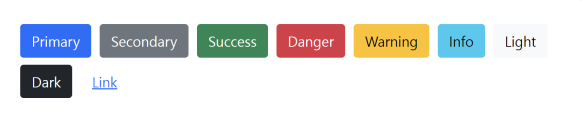
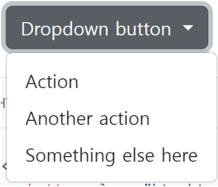
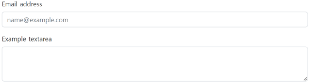
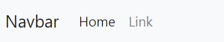
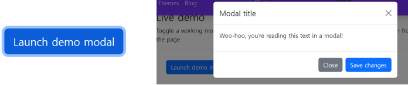

# Bootstrap 02
## Component
> Bootstrap의 다양한 UI 요소를 활용할 수 있음
>
> 아래 Components 탭 및 검색으로 원하는 UI 요소를 찾을 수 있음
>
> 기본 제공된 Components를 변환해서 활용

### Button
- 클릭 했을 때 어떤 동작이 일어나도록 하는 요소


```html 
<button type="button" class="btn btn-primary">Primary</button>
<button type="button" class="btn btn-secondary">Secondary</button>
<button type="button" class="btn btn-success">Success</button>
<button type="button" class="btn btn-danger">Danger</button>
<button type="button" class="btn btn-warning">Warning</button>
<button type="button" class="btn btn-info">Info</button>
<button type="button" class="btn btn-light">Light</button>
<button type="button" class="btn btn-dark">Dark</button>
<button type="button" class="btn btn-link">Link</button>
```

### Dropdowns
- dropdown, dropdown-menu, dropdown-item 클래스를 활용한 옵션 메뉴


```html
<div class="dropdown">
  <button class="btn btn-secondary dropdown-toggle" type="button" data-bs-toggle="dropdown" ariaexpanded="false">
  Dropdown button
  </button>
  <ul class="dropdown-menu">
    <li><a class="dropdown-item" href="#">Action</a></li>
    <li><a class="dropdown-item" href="#">Another action</a></li>
    <li><a class="dropdown-item" href="#">Something else here</a></li>
  </ul>
</div>
```

#### Forms > Form controls
- form-control 클래스를 사용해 `<input>` 및 `<form>` 태그를 스타일링


```html
<div class="mb-3">
  <label for="exampleFormControlInput1" class="form-label">Email address</label>
  <input type="email" class="form-control" id="exampleFormControlInput1"
  placeholder="name@example.com">
</div>
<div class="mb-3">
  <label for="exampleFormControlTextarea1" class="form-label">Example textarea</label>
  <textarea class="form-control" id="exampleFormControlTextarea1" rows="3"></textarea>
</div>
```

### Navbar
- 네비게이션 바 제작


```html
<nav class="navbar navbar-expand-lg bg-light">
  <div class="container-fluid">
    <a class="navbar-brand" href="#">Navbar</a>
    <button class="navbar-toggler" type="button" data-bs-toggle="collapse" data-bs-target="#navbarSupportedContent" ariacontrols="navbarSupportedContent" aria-expanded="false" aria-label="Toggle navigation">
      <span class="navbar-toggler-icon"></span>
    </button>
    <div class="collapse navbar-collapse" id="navbarSupportedContent">
      <ul class="navbar-nav me-auto mb-2 mb-lg-0">
        <li class="nav-item">
          <a class="nav-link active" aria-current="page" href="#">Home</a>
        </li>
        <li class="nav-item">
          <a class="nav-link" href="#">Link</a>
        </li>
      </ul>
    </div>
  </div>
</nav>
```

#### Carousel
- 콘텐츠(사진)을 순환시키기 위한 슬라이드쇼


```html
<div id="carouselExampleSlidesOnly" class="carousel slide" data-bs-ride="carousel">
  <div class="carousel-inner">
    <div class="carousel-item active">
      
    </div>
    <div class="carousel-item">
      
    </div>
    <div class="carousel-item">
      
    </div>
  </div>
</div>
```

#### Modal
- 사용자와 상호작용 하기 위해서 사용하며, 긴급 상황을 알리는 데 주로 사용
- 현재 열려 있는 페이지 위에 또 다른 레이어를 띄움
- 페이지를 이동하면 자연스럽게 사라짐(제거를 하지 않고도 배경 클릭시 사라짐 – 옵션에 따라 다름)


```html
<!-- Button trigger modal -->
<button type="button" class="btn btn-primary" data-bs-toggle="modal" data-bs-target="#exampleModal">
Launch demo modal
</button>
<!-- Modal -->
<div class="modal fade" id="exampleModal" tabindex="-1" aria-labelledby="exampleModalLabel" aria-hidden="true">
  <div class="modal-dialog">
    <div class="modal-content">
      <div class="modal-header">
        <h5 class="modal-title" id="exampleModalLabel">Modal title</h5>
        <button type="button" class="btn-close" data-bs-dismiss="modal" aria-label="Close"></button>
      </div>
      <div class="modal-body">
        ...
      </div>
      <div class="modal-footer">
        <button type="button" class="btn btn-secondary" data-bs-dismiss="modal">Close</button>
        <button type="button" class="btn btn-primary">Save changes</button>
      </div>
    </div>
  </div>
</div>
```

### 컴포넌트 사용시 주의사항
**자바스크립트를 활용한 컴포넌트들을 사용할 때는 반드시 target과 id가 일치되어야 한다.**