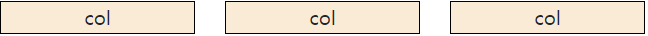

# Bootstrap 03
## Grid System
> 요소들의 디자인과 배치에 도움을 주는 시스템
### Bootstrap grid System
- Bootstrap Grid system은 flexbox로 제작됨
- container, rows, column으로 컨텐츠를 배치하고 정렬
- **12개의 column과 6개의 grid breakpoints로 구성**

```html
<div class="container">
  <div class="row">
    <div class="col">col</div>
    <div class="col">col</div>
    <div class="col">col</div>
  </div>
</div>
```


- container
  - container가 감싸고 있는 contents를 가운데 정렬해줌
  - 반응형으로 width를 지정하고 싶을 경우 => `.container` 사용
  - width를 화면의 100%로 지정하고 싶을 경우 => `.container-fluid` 사용

- row
  - column을 감싸주는 역할

- column
  - row에 들어가는 각각의 content
  - 옵션을 지정 안 하면 블록 요소처럼 한 줄씩 차지함
  - 옵션 지정 방법: 1개의 row를 **가로로 12칸으로 나눴을 때 몇 칸을 차지할 것인지**를 숫자로 적어줌

### breakpoints
> 다양한 디바이스에서 적용하기 위한 특정 px(픽셀) 조건에 대한 지점


```html
<div class="container">
  <div class="row">
    <div class="row my-3">
      <div class="col-12 col-sm-6 col-md-4 col-lg-3">
        <div class="box">col</div>
      </div>
      <div class="col-12 col-sm-6 col-md-4 col-lg-3">
        <div class="box">col</div>
      </div>
      <div class="col-12 col-sm-6 col-md-4 col-lg-3">
        <div class="box">col</div>
      </div>
      <div class="col-12 col-sm-6 col-md-4 col-lg-3">
        <div class="box">col</div>
      </div>
      <div class="col-12 col-sm-6 col-md-4 col-lg-3">
        <div class="box">col</div>
      </div>
      <div class="col-12 col-sm-6 col-md-4 col-lg-3">
        <div class="box">col</div>
      </div>
    </div>
  </div>
</div>
```

- xs - 가장 작은 화면


- sm - 모바일


- md - 태블릿


### gutters
> column 사이의 padding

```html
<div class="container">
  <<div class="row my-3">
      <div class="col-6"><div class="box">col-6</div></div>
      <div class="col-6"><div class="box">col-6</div></div>
    </div>
    <div class="row g-0 my-3">
      <div class="col-6"><div class="box">col-6</div></div>
      <div class="col-6"><div class="box">col-6</div></div>
    </div>
</div>
```


### offset
> 지정한 만큼의 column 공간을 무시하고 다음 공간부터 콘텐츠를 적용

```html
<div class="container">
  <<div class="row my-3">
      <div class="col-6"><div class="box">col-6</div></div>
      <div class="col-6"><div class="box">col-6</div></div>
    </div>
    <div class="row g-0 my-3">
      <div class="col-6"><div class="box">col-6</div></div>
      <div class="col-6"><div class="box">col-6</div></div>
    </div>
</div>
```


### nesting
> row > col-* > row > col-* 방식으로 중첩 사용 가능

```html
<div class="container">
    <!-- nesting, row안의 row -->
    <div class="row">
      <div class="box col-6">
        <div class="row">
          <div class="box col-3">1</div>
          <div class="box col-3">2</div>
          <div class="box col-3">3</div>
          <div class="box col-3">4</div>
        </div>
      </div>
      <div class="box col-6">1</div>
      <div class="box col-6">2</div>
      <div class="box col-6">3</div>
    </div>
</div>
```

