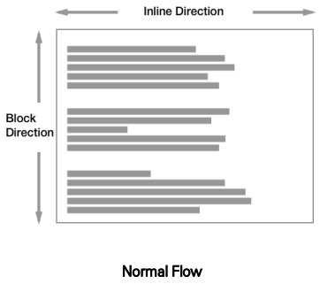
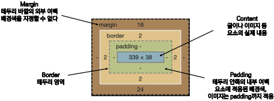
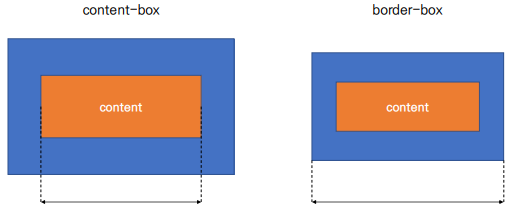
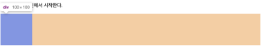
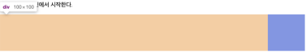
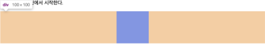

# CSS
## CSS 기본 스타일
### 크기 단위
- px(픽셀)
  - 모니터 해상도의 한 화소인 '픽셀' 기준
  - 픽셀의 크기는 변하지 않기 때문에 고정적인 단위
- %
  - 백분율 단위
  - 가변적인 레이아웃에서 자주 사용
- em
  - (바로 위, 부모 요소에 대한) 상속의 영향을 받음
  - 배수 단위, 요소에 지정된 사이즈에 상대적인 사이즈를 가짐
- rem
  - (바로 위, 부모 요소에 대한) 상속의 영향을 받지 않음
  - 최상위 요소(html)의 사이즈를 기준으로 배수 단위를 가짐

```html
<body>
  <ul class="font-big">
    <li class="em">2em</li>
    <li class="rem">2rem</li>
    <li>no class</li>
  </ul>
</body>
```
```html
<style>
  .font-big {
    font-size: 36px;
  }
  .em {
    font-size: 2em;
  }
  .rem {
    font-size: 2rem;
  }
</style>
```

### 크기 단위(viewport)
- 웹 페이지를 방문한 유저에게 바로 보이게 되는 웹 컨텐츠의 영역 (디바이스 화면)
- 디바이스의 viewport를 기준으로 상대적인 사이즈가 결정됨

```html
<body>
  <h1 class="px">px사용</h1>
  <h1 class="vw">vw사용</h1>
</body>
```
```html
<style>
  h1 {
    color: black;
    background-color: pink;
  }
  .px {
    width: 200px;
  }
  .vw {
    width: 50vw;
  }
</style>
```
### 색상 단위
- 색상 키워드 `background-color: red;`
  - 대소문자를 구분하지 않음
  - red, blue, black 과 같은 특정 색을 직접 글자로 나타냄
- RGB 색상 `background-color: rgb(0, 255, 0);`
  - 16진수 표기법 혹은 함수형 표기법을 사용해서 특정 색을 표현하는 방식
  - `#` + 16진수 표기법
  - `rgb()` 함수형 표기법
- HSL 색상 `background-color: hsl(0, 100%, 50%);`
  - 색상, 채도, 명도를 통해 특정 색을 표현하는 방식
- a : alpha(투명도)

```html
p { color: black; }
p { color: #000; }
p { color: #000000; }
p { color: rgb(0, 0, 0); }
p { color: hsl(120, 100%, 0); }
p { color: rgba(0, 0, 0, 0.5); }
p { color: hsla(120, 100% 0.5);}
```
### CSS 문서 표현
- 텍스트
  - 서체(font-family), 서체 스타일(font-style, font-weight 등)
  - 자간(letter-spacing), 단어 간격(word-spacing), 행간(line-height) 등
- 컬러(color), 배경(background-image, background-color)
- 기타 HTML 태그별 스타일링
  - 목록(li), 표(table)

## CSS Selectors
### 선택자(Selector) 유형
- 기본 선택자
  - 전체 선택자, 요소 선택자
  - 클래스 선택자, 아이디 선택자, 속성 선택자
- 결합자(Combinators)
  - 자손 결합자, 자식 결합자
  - 일반 형제 결합자, 인접 형제 결합자
- 의사 클래스/요소(Pseudo Class)
  - 링크, 동적 의사 클래스
  - 구조적 의사 클래스, 기타 의사 클래스, 의사 엘리먼트, 속성 선택자
### CSS 선택자 정리
- 요소 선택자
  - HTML 태그를 직접 선택
- 클래스(class) 선택자
  - 마침표(.)문자로 시작하며, 해당 클래스가 적용된 항목을 선택
- 아이디(id) 선택자
  - `#` 문자로 시작하며, 해당 아이디가 적용된 항목을 선택
  - 일반적으로 하나의 문서에 1번만 사용
  - 여러 번 사용해도 동작하지만, 단일 id를 사용하는 것을 권장
### CSS 적용 우선순위 (cascading order)
1. 중요도 (Importance) : 사용시 주의
  - `!important`
2. 우선 순위 (Specificity)
  - `인라인 > id > class, 속성, pseudo-class > 요소, pseudo-element`
3. CSS 파일 로딩 순서
### CSS 상속
- CSS는 상속을 통해 부모 요소의 속성을 자식에게 상속한다.
- MDN에서 확인할 수 있다.
- 속성(프로퍼티) 중에는 상속이 되는 것과 되지 않는 것들이 있다.
  - 상속 되는 것 예) Text 관련 요소(font, color, text-align), opacity, visibility 등
  - 상속 되지 않는 것 예) Box model 관련 요소(width, height, margin, padding, border, box-sizing, display), position 관련 요소(position, top/right/bottom/left, z-index) 등

```html
<body>
  <p>안녕하세요! <span>테스트</span> 입니다.</p>
</body>
```
```html
<style>
  p {
    /* 상속됨 */
    color: red;
    /* 상속 안됨 */
    border: 3px solid black;
  }
  span {
  }
</style>
```
## CSS Box model
### CSS 원칙 1
> 모든 요소는 네모(박스모델)이고, 위에서부터 아래로, 왼쪽에서 오른쪽으로 쌓인다. (좌측 상단에 배치)


### Box model
- 모든 HTML 요소는 box 형태로 되어있다.
- 하나의 박스는 네 부분(영역)으로 이루어진다.
  - margin
  - border
  - padding
  - content


```css
 /* padding - 상하좌우 */
.padding {
  padding: 30px;
}
```
```css
 /* margin - 상/하/좌/우 */
.margin-1 {
  margin: 10px;
}

 /* margin - 상하/좌우 */
.margin-2 {
  margin: 10px 20px;
}

 /* margin - 상/좌우/하 */
.margin-3 {
  margin: 10px 20px 30px;
}

 /* margin - 상/좌/우/하 */
.margin-4 {
  margin: 10px 20px 30px 40px;
}
```
```css
 /* border - 상하좌우 */
.border {
  border-width: 2px;
  border-style: dashed;
  border-color: black;
}
 /* 위랑 같은말 */
.border {
  border: 2px dashed black;
}
```

#### box-sizing
- 기본적으로 모든 요소의 box-sizing은 content-box
  - Padding을 제외한 순수 contents 영역만을 box로 지정
- 다만, 우리가 일반적으로 영역을 볼 때는 border까지의 너비를 100px 보는 것을 원함
  - 그 경우 box-sizing을 border-box로 설정



## CSS Display
### CSS 원칙 2
> display에 따라 크기와 배치가 달라진다.

### display
- `display: block`
  - 줄 바꿈이 일어나는 요소
  - 화면 크기 전체의 가로 폭을 차지한다.
  - 블록 레벨 요소 안에 인라인 레벨 요소가 들어갈 수 있다.
  - 대표적인 블록 레벨 요소 : div / ul, ol, li / p / hr / form 등
- `display: inline`
  - 줄 바꿈이 일어나지 않는 행의 일부 요소
  -  content 너비만큼 가로 폭을 차지한다.
  -  width, height, margin-top, margin-bottom을 지정할 수 없다.
  -  상하 여백은 line-height로 지정한다.
  - 대표적인 인라인 레벨 요소 : span / a / img / input, label / b, em, i, strong 등
- `display: inline-block`
  - block과 inline 레벨 요소의 특징을 모두 가진다.
  - inline처럼 한 줄에 표시할 수 있고, block처럼 width, height, margin 속성을 모두 지정할 수 있다.
- `display: none`
  - 해당 요소를 화면에 표시하지 않고, 공간조차 부여되지 않는다.
  - 이와 비슷한 visibility: hidden은 해당 요소가 공간은 차지하나 화면에 표시만 하지 않는다.
#### 속성에 따른 수평 정렬
- `margin-right: auto;`, `text-align: left;`

- `margin-left: auto;`, `text-align: right;`

- `margin-right: auto; margin-left: auto`, `text-align: center;`


## REFERENCE
[display 속성]( https://developer.mozilla.org/ko/docs/Web/CSS/display)