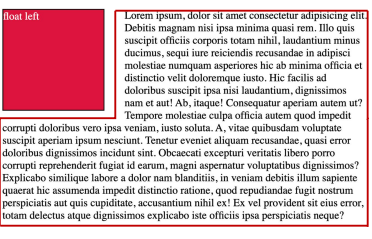
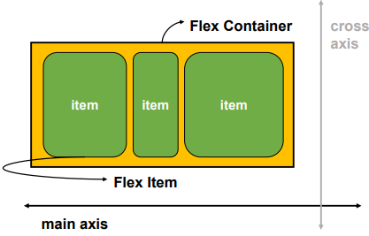
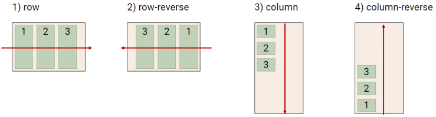
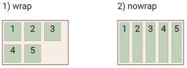
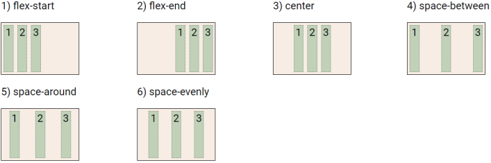
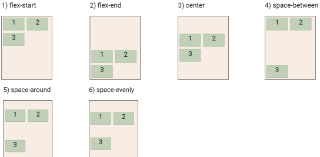
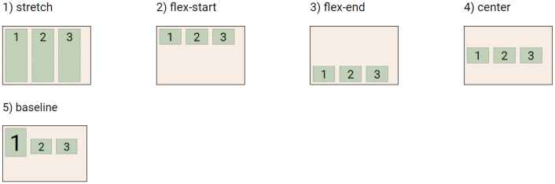
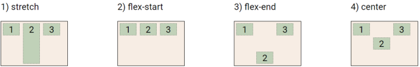
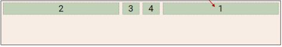

# CSS 02
## CSS Position
> 문서 상에서 요소의 위치 지정

- `static` : 모든 태그의 기본 값(기준 위치)
  - 일반적인 요소의 배치 순서에 따름(좌측 상단)
  - 부모 요소 내에서 배치될 때는 부모 요소의 위치를 기준으로 배치
- `relative` : 상대 위치
  - 자기 자신의 static 위치를 기준으로 이동 (normal flow 유지)
  - 레이아웃에서 요소가 차지하는 공간은 static일 때와 같음 (normal position 대비 offset)
  - 실제 위치는 그대로이고, 사람 눈에만 이동
```html
.realative {
    position: relative;
    <!-- 기준 위치 대비 offset -->
    top: 100px; 
    left: 100px;
}
```
- `absolute` : 절대 위치
  - 요소를 일반적인 문서 흐름에서 제거 후 레이아웃에 공간을 차지하지 않음 (normal flow에서 벗어남)
  - static이 아닌 가장 가까이 있는 부모/조상 요소를 기준으로 이동 (없는 경우 브라우저 화면 기준으로 이동)
  - 다음 블록 요소가 좌측 상단으로 붙음
```html
.parent {
    position: relative
}

.absolute-child {
    position: absolute;
    <!-- 기준 위치에서 벗어나 부모/조상 요소를 기준으로 위치 -->
    top: 50px;
    left: 50px;
}
```
- `fixed` : 고정 위치
  - 요소를 일반적인 문서 흐름에서 제거 후 레이아웃에 고간을 차지하지 않음 (normal flow에서 벗어남)
  - 부모 요소와 관계없이 viewport를 기준으로 이동
    - 스크롤 시에도 항상 같은 곳에 위치
```html
.fixed {
    position: fixed;
    <!-- 기준 위치에서 벗어나 Viewport 기준으로 위치 -->
    bottom: 0;
    right: 0;
}
```
- `sticky` : 스크롤에 따라 static에서 fixed로 변경
  - 속성을 적용한 박스는 평소에 문서 안에서 position: static 상태와 같이 일반적인 흐름에 따르지만 스크롤 위치가 임계점에 이르면 position: fixed와 같이 박스를 화면에 고정할 수 있는 속성
  - 일반적으로 Navigation Bar에서 사용

### CSS 원칙 3
> position으로 위치의 기준을 변경
>
> `relative` : 본인의 원래 위치, `absolute` : 특정 부모의 위치, `fixed` : 화면의 위치, `sticky` : 기본적으로 static이나 스크롤 이동에 따라 fixed로 변경

## CSS Layout
### Float
- 박스를 왼쪽 혹은 오른쪽으로 이동시켜 텍스트를 포함 인라인요소들이 주변을 wrapping 하도록 함
- 요소가 Normal flow를 벗어나도록 함
```html
<body>
  <div class="box left">float left</div>
  <p>lorem300</p>
</body>
```
```html
.box {
  width: 150px;
  height: 150px;
  border: 1px solid black;
  background-color: crimson;
  color: white;
  margin-right: 30px;
}

.left {
  float: left;
}
```



### Flexbox
#### CSS Flexible Box Layout
> 행과 열 형태로 아이템들을 배치하는 1차원 레이아웃 모델

- 축
  - main axis (메인 축)
  - cross axis (교차 축)
- 구성 요소
  - Flex Container (부모 요소)
  - Fles Item (자식 요소)



#### Flexbox 구성 요소
- Flex Container (부모 요소)
  - flexbox 레이아웃을 형성하는 가장 기본적인 모델
  - Flex Item들이 놓여있는 영역
  - display 속성을 flex 혹은 inline-flex로 지정
- Flex Item (자식 요소)
  - 컨테이너에 속해 있는 컨텐츠(박스)

```html
.flex-container {
  display: flex;
}
```

#### Flex 속성
- 배치 설정
  - `flex-direction`
    - Main axis 기분 방향 설정
    - 역방향의 경우 HTML 태그 선언 순서와 시각적으로 다르니 유의 (웹 접근성에 영향)



  - `flex-wrap`
    - 아이템이 컨테이너를 벗어나는 경우 해당 영역 내에 배치되도록 설정
    - 기본적으로 컨테이너 영역을 벗어나지 않도록 함
    - nowrap(기본 값) : 한줄에 배치, wrap : 넘치면 그 다음 줄로 배치



  - `flex-flow`
    - flex-direction과 flex-wrap의 shorthand
    - flex-direction과 flex-wrap에 대한 설정 값을 차례로 작성
    - 예) `flex-flow: row nowrap;`

- 공간 나누기
    - `justify-content`
        - Main axis를 기준으로 공간 배분

    

    - `align-content`
        - Cross axis를 기준으로 공간 배분 (아이템이 한 줄로 배치되는 경우 확인할 수 없음)

    

  - flex-start (기본 값) : 아이템들을 axis 시작점으로
  - flex-end : 아이템들을 axis 끝 쪽으로
  - center : 아이템들을 axis 중앙으로
  - space-between : 아이템 사이의 간격을 균일하게 분배
  - space-around : 아이템을 둘러싼 영역을 균일하게 분배 (가질 수 있는 영역을 반으로 나눠서 양쪽에)
  - space-evenly : 전체 영역에서 아이템 간 간격을 균일하게 분배

- 정렬
  - `align-items`
    - 모든 아이템을 Cross axis를 기준으로 정렬

  

  - `align-self`
    - 개별 아이템을 Cross axis 기준으로 정렬
    -  해당 속성은 컨테이너에 적용하는 것이 아니라 개별 아이템에 적용

  
  
  - stretch (기본 값) : 컨테이너를 가득 채움
  - flex-start : 위
  - flex-end : 아래
  - center : 가운데
  - baseline : 텍스트 baseline에 기준선을 맞춤

- 기타 속성
  - flex-grow : 남은 영역을 아이템에 분배
  - order : 배치 순서

```html
<div class="flex_item grow-1 order-3">1</div>
<div class="flex-item grow-1">2</div>
<div class="flex-item order-1">3</div>
<div class="flex-item order-2">4</div>
```
