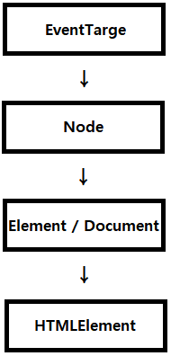

# JAVASCRIPT 01
## 인트로
### 브라우저 (browser)
- URL로 웹(WWW)을 탐색하며 서버와 통신하고,
HTML 문서나 파일을 출력하는 GUI 기반의 소프트웨어
- 인터넷의 컨텐츠를 검색 및 열람하도록 함
- "웹 브라우저”라고도 함
- 주요 브라우저
  - Google Chrome, Mozilla Firefox, Microsoft Edge, Opera, Safari
### JavaScript의 필요성
- 브라우저 화면을 ‘동적’으로 만들기 위함
- 브라우저를 조작할 수 있는 유일한 언어
### JavaScript의 탄생
- 1994년 당시 넷스케이프 커뮤니케이션스사의 Netscape Navigator(NN) 브라우저가
전 세계 점유율을 80% 이상 독점하며 브라우저의 표준 역할을 함
- 당시 넷스케이프에 재직 중인던 브랜던 아이크가
HTML을 동적으로 동작하기 위한 회사 내부 프로젝트를 진행 중 JS를 개발
- JavaScript 이름 변천사
  - Mocha -> LiveScript -> JavaScript (1995)
- 그러나 1995년 경쟁사 마이크로소프트에서 이를 채택하여 커스터마이징한 JScript를 만듦
- 이를, IE 1.0 에 탑재 -> 1차 브라우저 전쟁의 시작
#### 파편화와 표준화
- 제1차 브라우저 전쟁 이후 수많은 브라우저에서 자체 자바스크립트 언어를 사용하게 됨
- 결국 서로 다른 자바스크립트가 만들어지면서 크로스 브라우징 이슈가 발생하여
웹 표준의 필요성이 제기
- 크로스 브라우징 (Cross Browsing)
  - W3C에서 채택된 표준 웹 기술을 채용하여 각각의 브라우저마다 다르게 구현되는 기술을
비슷하게 만들되, 어느 한쪽에 치우치지 않도록 웹 페이지를 제작하는 방법론 (동일성이 아닌 동등성)
  - 브라우저마다 렌더링에 사용하는 엔진이 다르기 때문
- 1996년부터 넷스케이프는 표준 제정의 필요성을 주장
  - ECMA 인터내셔널(정보와 통신 시스템을 위한 국제적 표준화 기구)에 표준 제정 요청
- 1997년 ECMAScript 1 (ES1) 탄생
- 제1차 브라우저 전쟁 이후 제기된 언어의 파편화를 해결하기 위해
각 브라우저 회사와 재단은 표준화에 더욱 적극적으로 힘을 모으기 시작
#### JavaScript ES6+
- 2015년 ES2015 (ES6) 탄생
- “Next-gen of JS”
- JavaScript의 고질적인 문제들을 해결
- JavaScript의 다음 시대라고 불릴 정도로 많은 혁신과 변화를 맞이한 버전
- 이때부터 버전 순서가 아닌 출시 연도를 붙이는 것이 공식 명칭이나 통상적으로 ES6라 부름
- 현재는 표준 대부분이 ES6+로 넘어옴
#### Vanilla JavaScript
- 크로스 브라우징, 간편한 활용 등을 위해 많은 라이브러리 등장 (jQuery 등)
- ES6 이후, 다양한 도구의 등장으로 순수 자바스크립트 활용의 증대

## DOM (Document Object Model)
### 브라우저에서 할 수 있는 일
- DOM 조작
  - 문서(HTML) 조작
- BOM 조작
  - navigator, screen, location, frames, history, XHR
- JavaScript Core (ECMAScript)
  - Data Structure(Object, Array), Conditional Expression, Iteration
### DOM
- HTML, XML과 같은 문서를 다루기 위한 문서 프로그래밍 인터페이스
- 문서를 구조화하고 구조화된 구성 요소를 하나의 객체로 취급하여 다루는 논리적 트리 모델
- 문서가 구조화되어 있으며 각 요소는 객체(object)로 취급
- 단순한 속성 접근, 메서드 활용뿐만 아니라 프로그래밍 언어적 특성을 활용한 조작 가능
- 주요 객체
  - window : DOM을 표현하는 창. 가장 최상위 객체 (작성 시 생략 가능)
  - document : 페이지 컨텐츠의 Entry Point 역할을 하며, `<body>` 등과 같은 수많은 다른 요소들을 포함
  - navigator, location, history, screen
#### DOM - 해석(파싱)
- 구문 분석, 해석
- 브라우저가 문자열을 해석하여 DOM Tree로 만드는 과정
### BOM
- Browser Object Model
- 자바스크립트가 브라우저와 소통하기 위한 모델
- 브라우저의 창이나 프레임을 추상화해서 프로그래밍적으로 제어할 수 있도록 제공하는 수단
  - 버튼, URL 입력창, 타이틀 바 등 브라우저 윈도우 및 웹 페이지 일부분을 제어 가능
- window 객체는 모든 브라우저로부터 지원받으며 브라우저의 창(window)를 지칭
### JavaScript Core
- 프로그래밍 언어
## DOM 조작
- Document는 문서 한 장(HTML)에 해당하고 이를 조작
- DOM 조작 순서
  1. 선택 (Select)
  2. 변경 (Manipulation)
### DOM 객체의 상속 구조

- EventTarget
  - Event Listener를 가질 수 있는 객체가 구현하는 DOM 인터페이스
- Node
  - 여러 가지 DOM 타입들이 상속하는 인터페이스
- Element
  - Document 안의 모든 객체가 상속하는 가장 범용적인 인터페이스
  - 부모인 Node와 그 부모인 EventTarget의 속성을 상속
- Document
  - 브라우저가 불러온 웹 페이지를 나타냄
  - DOM 트리의 진입점(entry point) 역할을 수행
- HTMLElement
  - 모든 종류의 HTML 요소
  - 부모 element의 속성 상속
### DOM 선택
#### 선택 관련 메서드
- **`document.querySelector(selector)`**
  - 제공한 선택자와 일치하는 element 하나 선택
  - 제공한 CSS selector를 만족하는 첫 번째 element 객체를 반환 (없다면 null)
- **`document.querySelectorAll(selector)`**
  - 제공한 선택자와 일치하는 여러 element를 선택
  - 매칭 할 하나 이상의 셀렉터를 포함하는 유효한 CSS selector를 인자(문자열)로 받음
  - 지정된 셀렉터에 일치하는 NodeList를 반환
- `document.getElementById(id)`
  - 주어진 문자열과 일치하는 id 속성을 가진 요소를 찾고, 이를 나타내는 Element 객체 반환
- `document.getElementsByTagName(name)`
  - 엘리먼트의 `HTMLCollection`과 주어진 태그명 반환
- `element.getElementsByClassName(names)`
  - 주어진 클래스를 가진 모든 자식 엘리먼트의 실시간 `HTMLCollection`을 반환
- `querySelector()`, `querySelectorAll()`을 사용하는 이유
  - id, class 그리고 tag 선택자 등을 모두 사용 가능하므로, 더 구체적이고 유연하게 선택 가능
  - ex) document.querySelector('#id’), document.querySelectAll(‘.class')
#### 선택 메서드별 반환 타입
- 단일 element
  - `getElementById()`
  - **`querySelector()`**
- HTMLCollection
  - `getElementsByTagName()`
  - `getElementsByClassName()`
- NodeList
  - `**querySelectorAll()**`
#### HTMLCollection & NodeList
- **HTMLCollection**
  - name, id, index 속성으로 각 항목에 접근 가능
- **NodeList**
  - index로만 각 항목에 접근 가능
  - 단, HTMLCollection과 달리 배열에서 사용하는 forEach 메서드 및 다양한 메서드 사용 가능
- 둘 다 Live Collection으로 DOM의 변경사항을 실시간으로 반영하지만, `querySelectorAll()`에 의해 반환되는 NodeList는 Static Collection으로 실시간으로 반영되지 않음
- 둘 다 배열과 같이 각 항목에 접근하기 위한 index를 제공 (유사 배열)
#### Collection
- **Live Collection**
  - 문서가 바뀔 때 실시간으로 업데이트 됨
  - DOM의 변경사항을 실시간으로 collection에 반영
  - ex) HTMLCollection, NodeList
- **Static Collection (non-live)**
  - DOM이 변경되어도 collection 내용에는 영향을 주지 않음
  - `querySelectorAll()`의 반환 NodeList만 static collection
### DOM 변경
#### 변경 관련 메서드 (Creation)
- **`document.createElement()`**
  - 작성한 태그 명의 HTML 요소를 생성하여 반환
#### 변경 관련 메서드 (append DOM)
- **`element.append()`**
  - 특정 부모 Node의 자식 NodeList 중 마지막 자식 다음에 Node 객체나 DOMString을 삽입
  - 여러 개의 Node 객체, DOMString을 추가 할 수 있음
  - 반환 값이 없음
- **`node.appendChild()`**
  - 한 Node를 특정 부모 Node의 자식 NodeList 중 마지막 자식으로 삽입 (Node만 추가 가능)
  - 한번에 오직 하나의 Node만 추가할 수 있음
  - 만약 주어진 Node가 이미 문서에 존재하는 다른 Node를 참조한다면 새로운 위치로 이동
- `ParentNode.append()` vs `Node.appendChild()`
  - `append()`를 사용하면 DOMString 객체를 추가할 수도 있지만, `appendChild()`는 Node 객체만 허용
  - `append()`는 반환 값이 없지만, `appendChild()`는 추가된 Node 객체를 반환
  - `append()`는 여러 Node 객체와 문자열을 추가할 수 있지만, `appendChild()`는 하나의 Node 객체만 추가할 수 있음
#### 변경 관련 속성 (property)
- **`node.innerText`**
  - Node 객체와 그 자손의 텍스트 컨텐츠(DOMString)를 표현 (해당 요소 내부의 raw text) (사람이 읽을 수 있는 요소만 남김)
  - 즉, 줄 바꿈을 인식하고 숨겨진 내용을 무시하는 등 최종적으로 스타일링이 적용된 모습으로 표현
- **`element.innerHTML`**
  - 요소(element) 내에 포함된 HTML 마크업을 반환
  - XSS 공격에 취약하므로 사용 시 주의
### DOM 삭제
#### 삭제 관련 메서드
- **'ChildNode.remove()'**
  - Node가 속한 트리에서 해당 Node를 제거
- **`Node.removeChild()`**
  - DOM에서 자식 Node를 제거하고 제거된 Node를 반환
  - Node는 인자로 들어가는 자식 Node의 부모 Node
### DOM 속성
#### 속성 관련 메서드
- **`element.setAttribute(name, value)`**
  - 지정된 요소의 값을 설정
  - 속성이 이미 존재하면 값을 갱신, 존재하지 않으면 지정된 이름과 값으로 새 속성을 추가
- **`element.getAttribute(attributeName)`**
  - 해당 요소의 지정된 값(문자열)을 반환
  - 인자(attributeName)는 값을 얻고자 하는 속성의 이름
## JavaScript 문법과 자료형
### 기본
- JavaScript는 문법의 대부분을 Java와 C, C++로부터 차용하고 있으며, Awk, Perl, Python의 영향도 받음
- 명령을 명령문(statement) (en-US)이라고 부르며, 세미콜론(;)으로 구분
- 명령문이 한 줄을 다 차지할 경우에는 세미콜론이 필요하지 않지만, 한 줄에 두 개 이상의 명령문이 필요하다면 반드시 세미콜론으로 구분
### 주석
```js
// 한 줄 주석

/* 이건 더 긴,
 * 여러 줄 주석
 */
```
### 선언
- `var`
  - 변수를 선언
  - 동시에 값을 초기화
- `let`
  - 블록 스코프 지역 변수를 선언
  - 추가로 동시에 값을 초기화
- `const`
  - 블록 스코프 읽기 전용 상수를 선언
#### 변수
- 문자, 밑줄 (_) 혹은 달러 기호 ($)로 시작해야 하고, 이후는 숫자 (0–9)도 가능
- 대소문자 구분
#### 변수 선언
- var 키워드로 변수 선언(`var x = 42`), const 혹은 let 키워드로 변수 선언(`let y = 13`)
- 구조 분해 할당 구문을 사용하여 객체 리터럴에서 값을 풀기 위해 변수 선언(`let { bar } = foo` bar라는 이름의 변수를 생성하고 foo 객체에 있는 동일한 이름의 키에 해당하는 값을 변수에 할당)
### 데이터 구조 및 데이터 형
#### 데이터 형
- `Boolean` - `true`와 `false`
- `null` - null 값
- `undefined` - 값이 정의되어 있지 않은 최상위 속성.
- `Number` - 정수 또는 실수형 숫자
- `BigInt` - 임의 정밀도의 정수
- `String` - 문자열
- `Symbol` - 인스턴스가 고유하고 불변인 데이터 형.
- `Object`
#### 자료형 변환
- JavaScript는 동적 형지정(정형) 언어이기때문에 변수를 선언할 때 데이터 형을 지정할 필요가 없다. 데이터 형이 스크립트 실행 도중 필요에 의해 자동으로 변환된다.
```js
var answer = 42;
answer = 'Thanks for all the fish...';
```
#### 문자열을 숫자로 변환하기
- `parseInt()`
- `parseFloat()`
### 리터럴
#### 배열 리터럴
```js
let coffees = ['French Roast', 'Colombian', 'Kona'];
```
#### 불리언 리터럴
- `true`
- `false`
#### 숫자 리터럴
- 다른 진법의 정수 리터럴과 10진수의 부동 소수점 리터럴
#### 정수 리터럴
- 정수와 BigInt 리터럴은 10진수, 16진수, 8진수 및 2진수로 표현
```js
0, 117, 123456789123456789n             // 10진수
015, 0001, 0o777777777777n              // 8진수
0x1123, 0x00111, 0x123456789ABCDEFn     // 16진수
0b11, 0b0011, 0b11101001010101010101n   // 2진수
```
#### 부동 소수점 리터럴
- 부호없는 10진 정수
- 소수점 (".")
- 소수 (또 다른 10진수)
- 지수
```js
3.1415926
.123456789
3.1E+12
.1e-23
```
#### 객체 리터럴
- 중괄호(`{}`)로 묶인 0개 이상인 객체의 속성명과 관련 값 쌍 목록
```js
var sales = 'Toyota';

function carTypes(name) {
  if (name === 'Honda') {
    return name;
  } else {
    return "Sorry, we don't sell " + name + ".";
  }
}

var car = { myCar: 'Saturn', getCar: carTypes('Honda'), special: sales };

console.log(car.myCar);   // Saturn
console.log(car.getCar);  // Honda
console.log(car.special); // Toyota
```
## JavaScript 제어문
### 블록문
- 명령문들을 그룹으로 묶는다.
- 블록은 한 쌍의 중괄호로 감싼다.
```js
{
  statement_1;
  statement_2;
  ⋮
  statement_n;
}
```
### `if...else` 문
```js
if (condition) {
  statement_1;
} else {
  statement_2;
}
```
- 거짓 값
- `false`
- `undefined`
- `null`
- `0`
- `NaN`
- 빈 문자열 (`""`)
### `switch` 문
```js
switch (expression) {
  case label_1:
    statements_1;
    break;
  case label_2:
    statements_2;
    break;
    …
  default:
    statements_default;
}
```
### 예외 처리 명령문
> `throw` 문을 사용하면 예외를 던지고, 던진 예외는 `try...catch` 문으로 처리

```js
function getMonthName(mo) {
  mo = mo - 1; // 배열 인덱스에 맞춰 월 조절 (1 = Jan, 12 = Dec)
  let months = ['Jan', 'Feb', 'Mar', 'Apr', 'May', 'Jun', 'Jul', 'Aug', 'Sep', 'Oct', 'Nov', 'Dec'];
  if (months[mo]) {
    return months[mo];
  } else {
    throw 'InvalidMonthNo'; // 여기서 throw 키워드 사용
  }
}

try {
  // 시도할 명령문
  monthName = getMonthName(myMonth); // 예외가 발생할 수 있는 함수
} catch (e) {
  monthName = 'unknown';
  logMyErrors(e); // 오류 처리기에 예외 객체 전달
}
```
- `throw` 문
```js
throw expression;
```
- `try...catch` 문
```js
try {
  throw 'myException'; // 예외 생성
} catch (e) {
  // 모든 예외를 처리하기 위한 명령문
  logMyErrors(e); // 오류 처리기에 예외 객체 전달
}
```
- `finally` 블록
  - `finally` 블록은 `try`와 `catch` 블록 실행이 끝난 후 이어서, 그리고 `try...catch...finally` 문 이후의 명령문들보다는 먼저 실행할 명령문
```js
openMyFile();
try {
  writeMyFile(theData); // 오류가 발생할 수 있는 코드
} catch (e) {
  handleError(e); // 오류가 발생하면 처리함
} finally {
  closeMyFile(); // 항상 리소스 해제
}
```
## JavaScript 반복문
### `for` 문
- 어떤 특정한 조건이 거짓으로 판별될 때까지 반복
```js
for ([초기문]; [조건문]; [증감문])
    문장
```
### `do...while` 문
- 특정한 조건이 거짓으로 판별될 때까지 반복
```js
do
    문장
while (조건문);
```
### `while` 문
- 어떤 조건문이 참이기만 하면 문장을 계속해서 수행
```js
while (조건문)
    문장
```
### 레이블 문
- 프로그램에서 다른 곳으로 참조할 수 있도록 식별자로 문을 제공
```js
label :
    statement
```
### `break` 문
- 반복문, switch문, 레이블 문과 결합한 문장을 빠져나올 때 사용
```js
break;
break [레이블];
```
### `continue` 문
- while, do-while, for, 레이블 문을 다시 시작하기 위해 사용
```js
continue;
continue label;
```
### `for...in` 문
- 객체의 열거 속성을 통해 지정된 변수를 반복
```js
for (variable in object) {
  statements
}
```
### `for...of` 문
- 각각의 고유한 특성의 값을 실행할 명령과 함께 사용자 지정 반복 후크를 호출하여, 반복 가능한 객체(배열, Map (en-US), Set, 인수 객체 등을 포함)를 통해 반복하는 루프
```js
for (variable of object) {
    statement
}
```
- `for...in` 문 vs `for...of` 문
  - `for...in` : 속성 이름을 통해 반복
  - `for...of` : 속성 값을 통해 반복
```js
let arr = [3, 5, 7];
arr.foo = "hello";

for (let i in arr) {
   console.log(i); // logs "0", "1", "2", "foo"
}

for (let i of arr) {
   console.log(i); // logs "3", "5", "7"
}
```
## JavaScript 함수
### 함수 선언
- 함수의 이름
- 괄호 안에서 쉼표로 분리된 함수의 매개변수 목록
- 중괄호 `{ }` 안에서 함수를 정의하는 자바스크립트 표현
```js
function square(number) {
  return number * number;
}
```
### 함수 표현식
- 모든 함수가 이름을 가질 필요는 없다.
```js
var square = function(number) { return number * number };
var x = square(4) // x 의 값은 16 입니다.
```
```js
var factorial = function fac(n) { return n<2 ? 1 : n*fac(n-1) };

console.log(factorial(3));
```
### 인수(arguments) 객체 사용하기
- 함수의 인수는 배열과 비슷한 객체로 처리
```js
arguments[i]
```
### 화살표 함수
```js
var a = [
  "Hydrogen",
  "Helium",
  "Lithium",
  "Beryl­lium"
];

var a2 = a.map(function(s){ return s.length });

console.log(a2); // logs [8, 6, 7, 9]

var a3 = a.map( s => s.length );

console.log(a3); // logs [8, 6, 7, 9]
```
## JavaScript 표현식과 연산자
### 연산자
#### 할당 연산자
|이름|단축 연산자|뜻|
| ---- | ---- | ---- |
|할당|x = y|x = y|
|더하기 할당|x += y|x = x + y|
|빼기 할당|x -= y|x = x - y|
|곱하기 할당|x *= y|x = x * y|
|나누기 할당|x /= y|x = x / y|
|나머지 할당|	x %= y|x = x % y|
|거듭제곱 할당|x **= y|	x = x ** y|
|왼쪽 시프트 할당|	x <<= y|x = x << y|
|오른쪽 시프트 할당|x >>= y|x = x >> y|
|부호 없는 오른쪽 시프트 할당|x >>>= y|x = x >>> y|
|비트 AND 할당|x &= y|x = x & y|
|비트 XOR 할당|x ^= y|x = x ^ y|
|비트 OR 할당|x |= y|x = x | y|
|논리 AND 할당|x &&= y|x && (x = y)|
|논리 OR 할당|x ||= y|x || (x = y)|
|널 병합 할당|x ??= y|x ?? (x = y)|
#### 비교 연산자
|연산자|설명|true를 반환하는 예제|
| ---- | ---- | ---- |
|동등 (==)|피연산자가 서로 같으면 true를 반환|`3 == var1``"3" == var1``3 == '3'`|
|부등 (!=)|피연산자가 서로 다르면 true를 반환|`var1 != 4``var2 != "3"`|
|일치 (===)|두 피연산자의 값과 타입이 모두 같은 경우 true를 반환|	`3 === var1`|
|불일치 (!==)|피연산자의 값 또는 타입이 서로 다를 경우 true를 반환|	`var1 !== "3"``3 !== '3'`|
|큼 (>)|왼쪽 피연산자가 오른쪽 피연산자보다 크면 true를 반환|`var2 > var1``"12" > 2`|
|크거나 같음 (>=)|왼쪽 피연산자가 오른쪽 피연산자와 같거나 크면 true를 반환|`var2 >= var1``var1 >= 3`|
|작음 (<)|왼쪽 피연산자가 오른쪽 피연산자보다 작으면 true를 반환|`var1 < var2``"2" < 12`|
|작거나 같음 (<=)|왼쪽 피연산자가 오른쪽 피연산자와 같거나 작으면 true를 반환|`var1 <= var2``var2 <= 5`|
#### 산술 연산자
|연산자|설명|
| ---- | ---- |
|나머지 (`%`)|이항 연산자, 두 피연산자를 나눴을 때의 나머지를 반환|
|증가 (`++`)|단항 연산자, 피연산자에 1을 더함|
|감소 (`--`)|단항 연산자, 피연산자에서 1을 뺌|
|단항 부정 (`-`)|단항 연산자, 피연산자의 부호를 반대로 바꾼 값을 반환|
|단항 플러스 (`+`)|단항 연산자, 피연산자가 숫자 타입이 아니면 숫자로 변환을 시도|
|거듭제곱 (`**`)|base^exponent, 즉 base를 exponent로 거듭제곱한 결과를 반환|
#### 비트 연산자
|연산자|사용법|설명|
| ---- | ---- | ---- |
|비트 AND|`a & b`|두 피연산자의 각 자리 비트의 값이 모두 1인 위치에 1을 반환|
|비트 OR |`a  b`|두 피연산자의 각 자리 비트의 값이 모두 0인 위치에 0을 반환|
|비트 XOR|`a ^ b`|두 피연산자의 각 자리 비트의 값이 서로 같은 위치에 0을 반환 [두 피연산자의 각 자리 비트의 값이 서로 다른 위치에 1을 반환]|
|비트 NOT|`~ a`|피연산자의 각 자리의 비트를 뒤집음|
|왼쪽 시프트|`a << b`|a의 이진 표현을 b만큼 왼쪽으로 이동하고, 오른쪽은 0으로 채움|
|오른쪽 시프트|`a >> b`|a의 이진 표현을 b만큼 오른쪽으로 이동하고, 1 미만으로 이동한 비트는 버림|
|부호 없는 오른쪽 시프트|`a >>> b`|a의 이진 표현을 b만큼 오른쪽으로 이동하고, 1 미만으로 이동한 비트는 버림, 왼쪽은 0으로 채움|
#### 논리 연산자
|연산자|사용법|설명|
| ---- | ---- | ---- |
|논리 AND (&&)|`expr1 && expr2`|`expr1`을 `false`로 변환할 수 있으면 `expr1`을 반환, 그 외의 경우에는 `expr2`를 반환, 따라서 불리언 값과 함께 사용한 경우, 둘 다 참일 때 `true`를, 그 외에는 `false`를 반환|
|논리 OR |`expr1  expr2`|`expr1`을 `true`로 변환할 수 있으면 `expr1`을 반환, 그 외의 경우에는 `expr2`를 반환, 따라서 불리언 값과 함께 사용한 경우, 둘 중 하나가 참일 때 `true`를, 그 외에는 `false`를 반환|
|논리 NOT (!)|`!expr`|단일 피연산자를 `true`로 변환할 수 있으면 `false`를 반환, 그 외에는 `true`를 반환|
#### 조건 (삼항) 연산자
- 만약 condition이 참이라면, 조건 연산자는 val1을 반환하고, 그 외에는 val2를 반환
```js
condition ? val1 : val2;
```
#### 단항 연산자
> 오직 하나의 피연산자만 사용하는 연산
- `delete`
  - 객체의 속성을 삭제
```js
delete object.property;
delete object[propertyKey];
delete objectName[index];
```
- `typeof`
  - 피연산자 타입을 나타내는 문자열을 반환
  - `operand`는 문자열, 변수, 키워드, 객체 등 타입을 알아낼 값
```js
typeof operand
typeof (operand)
```
- `void`
  - 표현식을 평가할 때 값을 반환하지 않도록 지정
  - `expression`은 평가할 JavaScript 표현식
```js
void (expression)
void expression
```
#### 관계 연산자
> 피연산자를 서로 비교하고, 비교 결과가 참인지에 따라 불리언 값을 반환
- `in`
  - 지정한 속성이 지정한 객체에 존재할 경우 `true`를 반환
  - `propNameOrNumber`는 속성이나 배열 인덱스를 나타내는 문자열, 숫자, 심볼 표현식, `objectName`은 객체의 이름
```js
propNameOrNumber in objectName
```
- `instanceof`
  - 지정한 객체가 지정한 객체 타입에 속하면 `true`를 반환
  - `objectName`은 `objectType`과 비교할 객체의 이름, `objectType`은 `Date`, `Array`와 같은 객체 타입
```js
objectName instanceof objectType
```
#### 연산자 우선순위
맴버 접근	`.` `[]` > 인스턴스 호출/생성	`()` `new` > 증감	`!` `~` `-` `+` `++` `--` `typeof` `void` `delete` > 거듭제곱	`**` > 곱하기/나누기	`*` `/` `%` > 더하기/빼기	`+` `-` > 비트 시프트	`<<` `>>` `>>>` > 관계	`<` `<=` `>` `>=` `in` `instanceof` > 동등/일치	`==` `!=` `===` `!==` > 비트 AND	`&` > 비트 XOR	`^` > 비트 OR	`|` > 논리 AND	`&&` > 논리 OR	`||` > 조건	`?:` > 할당	`=` `+=` `-=` `**=` `*=` `/=` `%=` `<<=` `>>=` `>>>=` `&=` `^=` `|=` `&&=` `||=` `??=` > 쉼표	`,`
### 표현식
> 어떤 값으로 이행하는 임의의 유효한 코드 단위
#### 일차 표현식
- `this`
  - 현재 객체 참조
```js
this['propertyName']
this.propertyName
```
#### 좌변 표현식
- `new`
  - 사용자 정의 객체 타입이나 내장 객체 타입의 인스턴스를 생성
```js
var objectName = new objectType([param1, param2, ..., paramN]);
```
- `super`
  - 객체의 부모가 가진 함수를 호출할 때 사용
  - 클래스에서 부모의 생성자를 호출해야 할 때 사용
```js
super([arguments]); // 부모 생성자 호출
super.functionOnParent([arguments]);
```