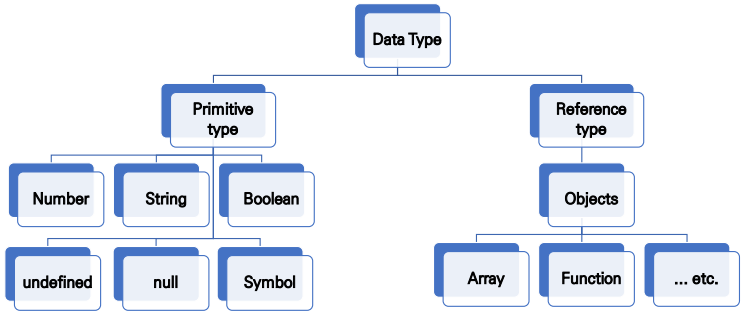

# JAVASCRIPT 02 - ECMA Script
## 변수와 식별자
- 명령을 명령문(statement)이라고 부르며, 세미콜론(;)으로 구분
- 명령문이 한 줄을 다 차지할 경우에는 세미콜론이 필요하지 않지만, 한 줄에 두 개 이상의 명령문이 필요하다면 반드시 세미콜론으로 구분
### 주석
```js
// 한 줄 주석

/* 이건 더 긴,
 * 여러 줄 주석
 */
```
### 선언
- `var`
  - 변수를 선언
  - 동시에 값을 초기화
- `let`
  - 블록 스코프 지역 변수를 선언
  - 추가로 동시에 값을 초기화
- `const`
  - 블록 스코프 읽기 전용 상수를 선언
#### 변수
- 식별자(identifier)는 변수를 구분할 수 있는 변수명을 말함
- 문자, 밑줄 (_) 혹은 달러 기호 ($)로 시작해야 하고, 이후는 숫자 (0–9)도 가능
- 대소문자를 구분하며, 클래스명 외에는 모두 소문자로 시작
- 예약어 사용 불가능
#### 변수 선언
- 선언  (Declaration)
  - 변수를 생성하는 행위 또는 시점
  - var 키워드로 변수 선언(`var x = 42`), const 혹은 let 키워드로 변수 선언(`let y = 13`)
- 할당 (Assignment)
  - 선언된 변수에 값을 저장하는 행위 또는 시점
- 초기화 (Initialization)
  - 선언된 변수에 처음으로 값을 저장하는 행위 또는 시점
```js
let foo // 선언
console.log(foo) // undefined

foo = 11 // 할당
console.log(foo) // 11

let bar = 0
console.log(bar) // 0
```
#### 호이스팅 (hoisting)
- 변수를 선언 이전에 참조할 수 있는 현상
- 변수 선언 이전의 위치에서 접근 시 undefined를 반환
- 자바스크립트는 모든 선언을 호이스팅
- var, let, const 모두 호이스팅이 발생하지만, var는 선언과 초기화가 동시에 발생하여 일시적 사각지대가 존재하지 않는다. 
```js
console.log(username) // undefined
var username = '홍길동'

console.log(email) // Uncaught RefereneceError
var email = 'hong@gmail.com'

console.log(age) // Uncaught RefereneceError
var age = 50
```
#### let, const, var 비교
|키워드|재선언|재할당|스코프|비고
|----|----|----|----|----|
|let|X|O|블록 스코프|ES6부터 도입|
|const|X|X|블록 스코프|ES6부터 도입|
|var|O|O|**함수 스코프**|**사용 X**|
### 데이터 구조 및 데이터 타입

- 원시 타입 (Primitive type)
  - 객체 (object)가 아닌 기본 타입
  - 변수에 해당 타입의 값이 담김
  - 다른 변수에 복사할 때 실제 값이 복사됨
- 참조 타입 (Reference type)
  - 객체 (object) 타입의 자료형
  - 변수에 해당 객체의 참조 값이 담김
  - 다른 변수에 복사할 때 참조 값이 복사됨
#### 데이터 타입
- Boolean 타입
  - 논리적 참 또는 거짓을 나타내는 타입
  - true 또는 false로 표현
  - 조건문 또는 반복문에서 유용하게 사용
- `null`
  - 변수의 값이 없음을 의도적으로 표현할 때 사용하는 데이터 타입
```js
let firstName = null
console.log(firstName) // null

typeof null // object
```
- `undefined`
  - 변수의 값이 없음을 나타내는 데이터 타입
  - 변수 선언 이후 직접 값을 할당하지 않으면, 자동으로 undefined가 할당됨
- 숫자(Number) 타입
  - 정수, 실수 구분 없는 하나의 숫자 타입
  - 부동소수점 형식을 따름
  - NaN (Not-A-Number) : 계산 불가능한 경우 반환되는 값
```js
const a = 14 // 양의 정수
const b = -5 // 음의 정수
const c = 3.14 // 실수
const d = 2.998e8 // 거듭제곱
const e = Infinity // 양의 무한대
const f = -Infinity // 음의 무한대
const g = NaN // 산술 연산 불가
```
- 문자열 (String) 타입
  - 텍스트 데이터를 나타내는 타입
  - 16비트 유니코드 문자의 집합
  - 작은따옴표 또는 큰따옴표 모두 가능
  - 템플릿 리터럴 (Template Literal)
    - ES6부터 지원
    - 따옴표 대신 backtick(` `)으로 표현
    - ${ expression } 형태로 표현식 삽입 가능
```js
const firstName = 'Bradan'
const lastName = 'Eich'
const fullName = `${firstName} ${lastName}`

console.log(fullName) // Bradan Eich
```
- `Symbol` - 인스턴스가 고유하고 불변인 데이터 형.
- `Object`
#### 자동 형변환
- JavaScript는 동적 형지정(정형) 언어이기때문에 변수를 선언할 때 데이터 형을 지정할 필요가 없다.
- 데이터 형이 스크립트 실행 도중 필요에 의해 자동으로 변환된다.
```js
var answer = 42;
answer = 'Thanks for all the fish...';
```
|데이터 타입|거짓|참|
|----|----|----|
|Undefined|항상 거짓|X|
|Null|항상 거짓|X|
|Number|0, -0, NaN|나머지 모든 경우|
|String|빈 문자열|나머지 모든 경우|
|Object|X|항상 참|
#### 문자열을 숫자로 변환하기
- `parseInt()`
- `parseFloat()`
### 리터럴
#### 배열 리터럴
```js
let coffees = ['French Roast', 'Colombian', 'Kona'];
```
#### 불리언 리터럴
- `true`
- `false`
#### 숫자 리터럴
- 다른 진법의 정수 리터럴과 10진수의 부동 소수점 리터럴
#### 정수 리터럴
- 정수와 BigInt 리터럴은 10진수, 16진수, 8진수 및 2진수로 표현
```js
0, 117, 123456789123456789n             // 10진수
015, 0001, 0o777777777777n              // 8진수
0x1123, 0x00111, 0x123456789ABCDEFn     // 16진수
0b11, 0b0011, 0b11101001010101010101n   // 2진수
```
#### 부동 소수점 리터럴
- 부호없는 10진 정수
- 소수점 (".")
- 소수 (또 다른 10진수)
- 지수
```js
3.1415926
.123456789
3.1E+12
.1e-23
```
#### 객체 리터럴
- 중괄호(`{}`)로 묶인 0개 이상인 객체의 속성명과 관련 값 쌍 목록
```js
var sales = 'Toyota';

function carTypes(name) {
  if (name === 'Honda') {
    return name;
  } else {
    return "Sorry, we don't sell " + name + ".";
  }
}

var car = { myCar: 'Saturn', getCar: carTypes('Honda'), special: sales };

console.log(car.myCar);   // Saturn
console.log(car.getCar);  // Honda
console.log(car.special); // Toyota
```
## 제어문
### 블록문
- 명령문들을 그룹으로 묶는다.
- 블록은 한 쌍의 중괄호로 감싼다.
```js
{
  statement_1;
  statement_2;
  ⋮
  statement_n;
}
```
### `if...else` 문
- 조건은 소괄호(condition) 안에 작성
- 실행할 코드는 중괄호{} 안에 작성
- 블록 스코프 생성
```js
if (condition) {
  statement_1;
} else if (condition) {
  statement_2;
} else {
  statement_3;
}
```
- 거짓 값
- `false`
- `undefined`
- `null`
- `0`
- `NaN`
- 빈 문자열 (`""`)
### `switch` 문
- 표현식(expression)의 결과값을 이용한 조건문
- 표현식의 결과값과 case문의 오른쪽 값을 비교
- break 및 default문은 **선택적**으로 사용 가능
- break문을 만나거나 default문을 실행할 때까지 다음 조건문 실행
```js
switch (expression) {
  case label_1:
    statements_1;
    break;
  case label_2:
    statements_2;
    break;
    …
  default:
    statements_default;
}
```
### 예외 처리 명령문
> `throw` 문을 사용하면 예외를 던지고, 던진 예외는 `try...catch` 문으로 처리

```js
function getMonthName(mo) {
  mo = mo - 1; // 배열 인덱스에 맞춰 월 조절 (1 = Jan, 12 = Dec)
  let months = ['Jan', 'Feb', 'Mar', 'Apr', 'May', 'Jun', 'Jul', 'Aug', 'Sep', 'Oct', 'Nov', 'Dec'];
  if (months[mo]) {
    return months[mo];
  } else {
    throw 'InvalidMonthNo'; // 여기서 throw 키워드 사용
  }
}

try {
  // 시도할 명령문
  monthName = getMonthName(myMonth); // 예외가 발생할 수 있는 함수
} catch (e) {
  monthName = 'unknown';
  logMyErrors(e); // 오류 처리기에 예외 객체 전달
}
```
- `throw` 문
```js
throw expression;
```
- `try...catch` 문
```js
try {
  throw 'myException'; // 예외 생성
} catch (e) {
  // 모든 예외를 처리하기 위한 명령문
  logMyErrors(e); // 오류 처리기에 예외 객체 전달
}
```
- `finally` 블록
  - `finally` 블록은 `try`와 `catch` 블록 실행이 끝난 후 이어서, 그리고 `try...catch...finally` 문 이후의 명령문들보다는 먼저 실행할 명령문
```js
openMyFile();
try {
  writeMyFile(theData); // 오류가 발생할 수 있는 코드
} catch (e) {
  handleError(e); // 오류가 발생하면 처리함
} finally {
  closeMyFile(); // 항상 리소스 해제
}
```
## 반복문
### `for` 문
- 어떤 특정한 조건이 거짓으로 판별될 때까지 반복
- initialization
  - 최초 반복문 진입 시 1회만 실행되는 부분
- condition
  - 매 반복 시행 전 평가되는 부분
- expression
  - 매 반복 시행 이후 평가되는 부분
- 블록 스코프 생성
```js
for ([initialization]; [condition]; [expression])
    문장
```
### `do...while` 문
- 특정한 조건이 거짓으로 판별될 때까지 반복
```js
do
    문장
while (조건문);
```
### `while` 문
- 어떤 조건문이 참이기만 하면 문장을 계속해서 수행
```js
while (조건문)
    문장
```
### 레이블 문
- 프로그램에서 다른 곳으로 참조할 수 있도록 식별자로 문을 제공
```js
label :
    statement
```
### `break` 문
- 반복문, switch문, 레이블 문과 결합한 문장을 빠져나올 때 사용
```js
break;
break [레이블];
```
### `continue` 문
- while, do-while, for, 레이블 문을 다시 시작하기 위해 사용
```js
continue;
continue label;
```
### `for...in` 문
- 객체(object)의 속성(key)들을 순회할 때 사용
- 배열도 순회 가능하지만 권장하지 않음
- 실행할 코드는 중괄호 안에 작성
- 블록 스코프 생성
```js
for (variable in object) {
  statements
}
```
### `for...of` 문
- 반복 가능한(iterable) 객체를 순회하며 값을 꺼낼 때 사용
  - 반복 가능한(iterable) 객체의 종류: Array, Map, Set, String 등
- 실행할 코드는 중괄호 안에 작성
- 블록 스코프 생성
```js
for (variable of object) {
    statement
}
```
- `for...in` 문 vs `for...of` 문
  - `for...in` : 속성 이름을 통해 반복, 객체 순회 적합
  - `for...of` : 속성 값을 통해 반복, 배열 순회 적합
```js
let arr = [3, 5, 7];
arr.foo = "hello";

for (let i in arr) {
   console.log(i); // logs "0", "1", "2", "foo"
}

for (let i of arr) {
   console.log(i); // logs "3", "5", "7"
}
```
## 함수
### 함수의 정의
- 함수의 이름과 함께 정의하는 방식
- 3가지 부분으로 구성
  - 함수의 이름 (name)
  - 매개변수 (args)
  - 함수 body (중괄호 내부)
```js
function name(args) {
  // do something
}
```
```js
function add(num1, num2) {
  return num1 + num2
}

add(1, 2)
```
### 함수 선언식 (function declaration)
- 함수의 이름
- 괄호 안에서 쉼표로 분리된 함수의 매개변수 목록
- 중괄호 `{ }` 안에서 함수를 정의하는 자바스크립트 표현
```js
function square(number) {
  return number * number;
}
```
### 함수 표현식 (function expression)
- 함수를 표현식 내에서 정의하는 방식
  - 표현식 : 어떤 하나의 값으로 결정되는 코드의 단위
- 함수의 이름을 생략하고 익명 함수로 정의 가능
  - 익명 함수(anonymous function): 이름이 없는 함수
  - 익명 함수는 함수 표현식에서만 가능
- 3가지 부분으로 구성
  - 함수의 이름 (생략 가능)
  - 매개변수 (args)
  - 함수 body (중괄호 내부)
```js
const name = function (args) {
  // do something
}
```
```js
const add = function (num1, num2) {
    return num1 + num2
}

add(1, 2)
```
### 기본 인자 (default arguments)
- 인자 작성 시 '=' 문자 뒤 기본 인자 선언 가능
```js
const greeting = function (name = 'Anonymous') {
    return `Hi ${name}`
}

greeting() // Hi Anonymous
```
### 매개변수와 인자의 개수 불일치 허용
- 매개변수보다 인자의 개수가 많을 경우
```js
const noArgs = function () {
  return 0
}

noArgs(1, 2, 3) // 0

const twoArgs = function (arg1, arg2) {
  return [arg1, arg2]
}

twoArgs(1, 2, 3) // [1, 2]
```
- 매개변수보다 인자의 개수가 적을 경우
```js
const threeArgs = function (arg1, arg2, arg3) {
  return [arg1, arg2, arg3]
}

threeArgs() // [undefined, undefined, undefined]
threeArgs(1) // [1, undefined, undefined]
threeArgs(1, 2) // [1, 2, undefined]
```
### Rest Parameter
- rest parameter(…)를 사용하면 함수가 정해지지 않은 수의 매개변수를 배열로 받음
- 만약 rest parameter로 처리한 매개변수에 인자가 넘어오지 않을 경우에는, 빈 배열로 처리
```js
const restOpr = function (arg1, arg2, ...restArgs) {
  return [arg1, arg2, restArgs]
}

restArgs(1, 2, 3, 4, 5) // [1, 2, [3, 4, 5]]
restArgs(1, 2) // [1, 2, []]
```
### Spread operator
- spread operator(…)를 사용하면 배열 인자를 전개하여 전달 가능
```js
const spreadOpr = function (arg1, arg2, arg3) {
  return arg1 + arg2 + arg3
}

const numbers = [1, 2, 3]
spreadOpr(...numbers) // 6
```
### 함수 선언식과 표현식 비교 정리
<table>
  <tr>
    <td></td>
    <td>함수 선언식 (declaration)</td>
    <td>함수 선언식 (declaration)</td>
  </tr>
  <tr>
    <td>공통점</td>
    <td colspan="2">데이터 타입, 함수 구성 요소 (이름, 매개변수, 함수 body)</td>
  </tr>
  <tr>
    <td>차이점</td>
    <td>익명 함수 불가능</br>호이스팅 O</td>
    <td>익명 함수 가능</br>호이스팅 X</td>
  </tr>
</table>

### 화살표 함수 (Arrow Function)
- 함수를 비교적 간결하게 정의할 수 있는 문법
- function 키워드 생략 가능
- 함수의 매개변수가 단 하나 뿐이라면, ‘( )’ 도 생략 가능
- 함수 몸통이 표현식 하나라면 ‘{ }’과 return도 생략 가능
```js
const arrow1 = function (name) {
  return `hello, ${name}`
}

// 1. function 키워드 삭제
const arrow2 = (name) => { return `hello, ${name}` }

// 2. 매개변수가 1개일 경우에만 ( ) 생략 가능
const arrow3 = name => { return `hello, ${name}` }

// 3. 함수 바디가 return을 포함한 표현식 1개일 경우에 { } & return 삭제
가능
const arrow4 = name => `hello, ${name}`
```
## 표현식과 연산자
### 연산자
#### 할당 연산자
- 오른쪽에 있는 피연산자의 평가 결과를 왼쪽 피연산자에 할당하는 연산자
- 다양한 연산에 대한 단축 연산자 지원

|이름|단축 연산자|뜻|
| ---- | ---- | ---- |
|할당|x = y|x = y|
|더하기 할당|x += y|x = x + y|
|빼기 할당|x -= y|x = x - y|
|곱하기 할당|x *= y|x = x * y|
|나누기 할당|x /= y|x = x / y|
|나머지 할당|	x %= y|x = x % y|
|거듭제곱 할당|x **= y|	x = x ** y|
|왼쪽 시프트 할당|	x <<= y|x = x << y|
|오른쪽 시프트 할당|x >>= y|x = x >> y|
|부호 없는 오른쪽 시프트 할당|x >>>= y|x = x >>> y|
|비트 AND 할당|x &= y|x = x & y|
|비트 XOR 할당|x ^= y|x = x ^ y|
|비트 OR 할당|x |= y|x = x | y|
|논리 AND 할당|x &&= y|x && (x = y)|
|논리 OR 할당|x ||= y|x || (x = y)|
|널 병합 할당|x ??= y|x ?? (x = y)|
#### 비교 연산자
- 피연산자를 비교하고 결과값을 boolean으로 반환하는 연산자
- 문자열은 유니코드 값을 사용하며 표준 사전 순서를 기반으로 비교

|연산자|설명|true를 반환하는 예제|
| ---- | ---- | ---- |
|동등 (==)|피연산자가 서로 같으면 true를 반환|`3 == var1``"3" == var1``3 == '3'`|
|부등 (!=)|피연산자가 서로 다르면 true를 반환|`var1 != 4``var2 != "3"`|
|**일치 (===)**|두 피연산자의 값과 타입이 모두 같은 경우 true를 반환|	`3 === var1`|
|불일치 (!==)|피연산자의 값 또는 타입이 서로 다를 경우 true를 반환|	`var1 !== "3"``3 !== '3'`|
|큼 (>)|왼쪽 피연산자가 오른쪽 피연산자보다 크면 true를 반환|`var2 > var1``"12" > 2`|
|크거나 같음 (>=)|왼쪽 피연산자가 오른쪽 피연산자와 같거나 크면 true를 반환|`var2 >= var1``var1 >= 3`|
|작음 (<)|왼쪽 피연산자가 오른쪽 피연산자보다 작으면 true를 반환|`var1 < var2``"2" < 12`|
|작거나 같음 (<=)|왼쪽 피연산자가 오른쪽 피연산자와 같거나 작으면 true를 반환|`var1 <= var2``var2 <= 5`|
#### 산술 연산자
|연산자|설명|
| ---- | ---- |
|나머지 (`%`)|이항 연산자, 두 피연산자를 나눴을 때의 나머지를 반환|
|증가 (`++`)|단항 연산자, 피연산자에 1을 더함|
|감소 (`--`)|단항 연산자, 피연산자에서 1을 뺌|
|단항 부정 (`-`)|단항 연산자, 피연산자의 부호를 반대로 바꾼 값을 반환|
|단항 플러스 (`+`)|단항 연산자, 피연산자가 숫자 타입이 아니면 숫자로 변환을 시도|
|거듭제곱 (`**`)|base^exponent, 즉 base를 exponent로 거듭제곱한 결과를 반환|
#### 비트 연산자
|연산자|사용법|설명|
| ---- | ---- | ---- |
|비트 AND|`a & b`|두 피연산자의 각 자리 비트의 값이 모두 1인 위치에 1을 반환|
|비트 OR |`a  b`|두 피연산자의 각 자리 비트의 값이 모두 0인 위치에 0을 반환|
|비트 XOR|`a ^ b`|두 피연산자의 각 자리 비트의 값이 서로 같은 위치에 0을 반환 [두 피연산자의 각 자리 비트의 값이 서로 다른 위치에 1을 반환]|
|비트 NOT|`~ a`|피연산자의 각 자리의 비트를 뒤집음|
|왼쪽 시프트|`a << b`|a의 이진 표현을 b만큼 왼쪽으로 이동하고, 오른쪽은 0으로 채움|
|오른쪽 시프트|`a >> b`|a의 이진 표현을 b만큼 오른쪽으로 이동하고, 1 미만으로 이동한 비트는 버림|
|부호 없는 오른쪽 시프트|`a >>> b`|a의 이진 표현을 b만큼 오른쪽으로 이동하고, 1 미만으로 이동한 비트는 버림, 왼쪽은 0으로 채움|
#### 논리 연산자
|연산자|사용법|설명|
| ---- | ---- | ---- |
|논리 AND (&&)|`expr1 && expr2`|`expr1`을 `false`로 변환할 수 있으면 `expr1`을 반환, 그 외의 경우에는 `expr2`를 반환, 따라서 불리언 값과 함께 사용한 경우, 둘 다 참일 때 `true`를, 그 외에는 `false`를 반환|
|논리 OR |`expr1  expr2`|`expr1`을 `true`로 변환할 수 있으면 `expr1`을 반환, 그 외의 경우에는 `expr2`를 반환, 따라서 불리언 값과 함께 사용한 경우, 둘 중 하나가 참일 때 `true`를, 그 외에는 `false`를 반환|
|논리 NOT (!)|`!expr`|단일 피연산자를 `true`로 변환할 수 있으면 `false`를 반환, 그 외에는 `true`를 반환|
#### 조건 (삼항) 연산자
- 세 개의 피연산자를 사용하여 조건에 따라 값을 반환하는 연산자
- 삼항 연산자의 결과 값이기 때문에 변수에 할당 가능
- 한 줄에 표기하는 것을 권장
- 만약 condition이 참이라면, 조건 연산자는 val1을 반환하고, 그 외에는 val2를 반환
```js
condition ? val1 : val2;
```
#### 단항 연산자
> 오직 하나의 피연산자만 사용하는 연산
- `delete`
  - 객체의 속성을 삭제
```js
delete object.property;
delete object[propertyKey];
delete objectName[index];
```
- `typeof`
  - 피연산자 타입을 나타내는 문자열을 반환
  - `operand`는 문자열, 변수, 키워드, 객체 등 타입을 알아낼 값
```js
typeof operand
typeof (operand)
```
- `void`
  - 표현식을 평가할 때 값을 반환하지 않도록 지정
  - `expression`은 평가할 JavaScript 표현식
```js
void (expression)
void expression
```
#### 관계 연산자
> 피연산자를 서로 비교하고, 비교 결과가 참인지에 따라 불리언 값을 반환
- `in`
  - 지정한 속성이 지정한 객체에 존재할 경우 `true`를 반환
  - `propNameOrNumber`는 속성이나 배열 인덱스를 나타내는 문자열, 숫자, 심볼 표현식, `objectName`은 객체의 이름
```js
propNameOrNumber in objectName
```
- `instanceof`
  - 지정한 객체가 지정한 객체 타입에 속하면 `true`를 반환
  - `objectName`은 `objectType`과 비교할 객체의 이름, `objectType`은 `Date`, `Array`와 같은 객체 타입
```js
objectName instanceof objectType
```
#### 연산자 우선순위
> 맴버 접근	`.` `[]` > 인스턴스 호출/생성	`()` `new` > 증감	`!` `~` `-` `+` `++` `--` `typeof` `void` `delete` > 거듭제곱	`**` > 곱하기/나누기	`*` `/` `%` > 더하기/빼기	`+` `-` > 비트 시프트	`<<` `>>` `>>>` > 관계	`<` `<=` `>` `>=` `in` `instanceof` > 동등/일치	`==` `!=` `===` `!==` > 비트 AND	`&` > 비트 XOR	`^` > 비트 OR	`|` > 논리 AND	`&&` > 논리 OR	`||` > 조건	`?:` > 할당	`=` `+=` `-=` `**=` `*=` `/=` `%=` `<<=` `>>=` `>>>=` `&=` `^=` `|=` `&&=` `||=` `??=` > 쉼표	`,`
### 표현식
> 어떤 값으로 이행하는 임의의 유효한 코드 단위
#### 일차 표현식
- `this`
  - 현재 객체 참조
```js
this['propertyName']
this.propertyName
```
#### 좌변 표현식
- `new`
  - 사용자 정의 객체 타입이나 내장 객체 타입의 인스턴스를 생성
```js
var objectName = new objectType([param1, param2, ..., paramN]);
```
- `super`
  - 객체의 부모가 가진 함수를 호출할 때 사용
  - 클래스에서 부모의 생성자를 호출해야 할 때 사용
```js
super([arguments]); // 부모 생성자 호출
super.functionOnParent([arguments]);
```
## 문자열 (String)
### 문자열 관련 주요 메서드
- `string.includes(value)`
  - 문자열에 value가 존재하는지 판별 후 참 또는 거짓 반환
- `string.split(value)`
  - value가 없을 경우, 기존 문자열을 배열에 담아 반환
  - value가 빈 문자열일 경우 각 문자로 나눈 배열을 반환
  - value가 기타 문자열일 경우, 해당 문자열로 나눈 배열을 반환
- `string.replace(from, to)`
  - 문자열에 from 값이 존재할 경우, 1개만 to 값으로 교체하여 반환
- `string.replaceAll(from, to)`
  - 문자열에 from 값이 존재할 경우, 모두 to 값으로 교체하여 반환
- `string.trim()`
  - 문자열 시작과 끝의 모든 공백문자(스페이스, 탭, 엔터 등)를 제거한 문자열 반환
- `string.trimStart()`
  - 문자열 시작의 공백문자(스페이스, 탭, 엔터 등)를 제거한 문자열 반환
- `string.trimEnd()`
  - 문자열 끝의 공백문자(스페이스, 탭, 엔터 등)를 제거한 문자열 반환
## 배열 (Arrays)
### 배열의 정의와 특징
- 키와 속성들을 담고 있는 참조 타입의 객체(object)
- 순서를 보장하는 특징이 있음
- 주로 대괄호를 이용하여 생성하고, 0을 포함한 양의 정수 인덱스로 특정 값에 접근 가능
- 배열의 길이는 array.length 형태로 접근 가능
  - 배열의 마지막 원소는 array.length – 1로 접근
### 배열 관련 주요 메서드
- `array.reverse()`
  - 원본 배열의 요소들의 순서를 반대로 정렬
- `array.push()`
  - 배열의 가장 뒤에 요소 추가
- `array.pop()`
  - 배열의 마지막 요소 제거
- `array.unshift()`
  - 배열의 가장 앞에 요소 추가
- `array.shift()`
  - 배열의 첫번째 요소 제거
- `array.includes(value)`
  - 배열에 특정 값이 존재하는지 판별 후 참 또는 거짓 반환
- `array.indexOf(value)`
  - 배열에 특정 값이 존재하는지 확인 후 가장 첫 번째로 찾은 요소의 인덱스 반환
  - 만약 해당 값이 없을 경우 -1 반환
- `array.join([separator])`
  - 배열의 모든 요소를 연결하여 반환
  - separator(구분자)는 선택적으로 지정 가능하며, 생략 시 쉼표를 기본 값으로 사용
***
- 배열을 순회하며 특정 로직을 수행하는 메서드
- 메서드 호출 시 인자로 callback 함수를 받는 것이 특징
- `array.forEach(callback(element[, index[,array]]))`
  - 배열의 각 요소에 대해 콜백 함수를 한 번씩 실행
  - 콜백 함수는 3가지 매개변수로 구성
    - element: 배열의 요소
    - index: 배열 요소의 인덱스
    - array: 배열 자체
  - 반환 값(return)이 없는 메서드
- `array.map(callback(element[, index[, array]]))`
  - 배열의 각 요소에 대해 콜백 함수를 한 번씩 실행
  - 콜백 함수의 반환 값을 요소로 하는 새로운 배열 반환
  - 기존 배열 전체를 다른 형태로 바꿀 때 유용
- `array.filter(callback(element[, index[, array]]))`
  - 배열의 각 요소에 대해 콜백 함수를 한 번씩 실행
  - 콜백 함수의 반환 값이 참인 요소들만 모아서
새로운 배열을 반환
  - 기존 배열의 요소들을 필터링할 때 유용
- `array.reduce(callback(acc, element, [index[, array]])[, initialValue])`
  - 배열의 각 요소에 대해 콜백 함수를 한 번씩 실행
  - 콜백 함수의 반환 값들을 하나의 값(acc)에 누적 후 반환
  - reduce 메서드의 주요 매개변수
    - acc
      - 이전 callback 함수의 반환 값이 누적되는 변수
    - initialValue(optional)
      - 최초 callback 함수 호출 시 acc에 할당되는 값, default 값은 배열의 첫 번째 값
  - 빈 배열의 경우 initialValue를 제공하지 않으면 에러 발생
- `array.find(callback(element[, index[, array]]))`
  - 배열의 각 요소에 대해 콜백 함수를 한 번씩 실행
  - 콜백 함수의 반환 값이 참이면, 조건을 만족하는 첫번째 요소를 반환
  - 찾는 값이 배열에 없으면 undefined 반환
- `array.some(callback(element[, index[, array]]))`
  - 배열의 요소 중 하나라도 주어진 판별 함수를
통과하면 참을 반환
  - 모든 요소가 통과하지 못하면 거짓 반환
  - 빈 배열은 항상 거짓 반환
- `array.every(callback(element[, index[, array]]))`
  - 배열의 모든 요소가 주어진 판별 함수를
통과하면 참을 반환
  - 하나의 요소라도 통과하지 못하면 거짓 반환
  - 빈 배열은 항상 참 반환
## 객체 (Objects)
### 객체 정의와 특징
- 객체는 속성(property)의 집합이며, 중괄호 내부에 key와 value의 쌍으로 표현
- key는 문자열 타입만 가능
  - key 이름에 띄어쓰기 등의 구분자가 있으면 따옴표로 묶어서 표현
- value는 모든 타입(함수포함) 가능
- 객체 요소 접근은 점 또는 대괄호로 가능
  - key 이름에 띄어쓰기 같은 구분자가 있으면 대괄호 접근만 가능
```js
const me = {
  name: 'jack',
  phoneNumber: '01012345678',
  'samsung products': {
  buds: 'Galaxy Buds pro',
  galaxy: 'Galaxy s20'
  }
}

console.log(me.name)
console.log(me.phoneNumber)
console.log(me['samsung products'])
console.log(me['samsung products'].buds)
```
- 메서드는 객체의 속성이 참조하는 함수
- 객체.메서드명() 으로 호출 가능
- 메서드 내부에서는 this 키워드가 객체를 의미함
```js
const me = {
  firstName: 'John',
  lastName: 'Doe',
  getFullName: function () {
    return this.firstName + this.lastName
  }
}
```
### JSON (JavaScript Object Notation)
- key-value쌍의 형태로 데이터를 표기하는 언어 독립적 표준 포맷
- 자바스크립트의 객체와 유사하게 생겼으나 실제로는 문자열 타입
  - 따라서 JS의 객체로써 조작하기 위해서는 구문 분석(parsing)이 필수
- 자바스크립트에서는 JSON을 조작하기 위한 두 가지 내장 메서드를 제공
  - `JSON.parse()`
    - JSON => 자바스크립트 객체
  - `JSON.stringify()`
    - 자바스크립트 객체 => JSON