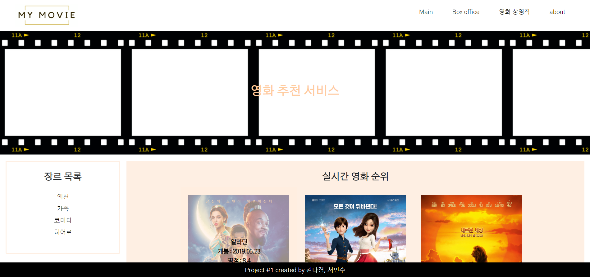
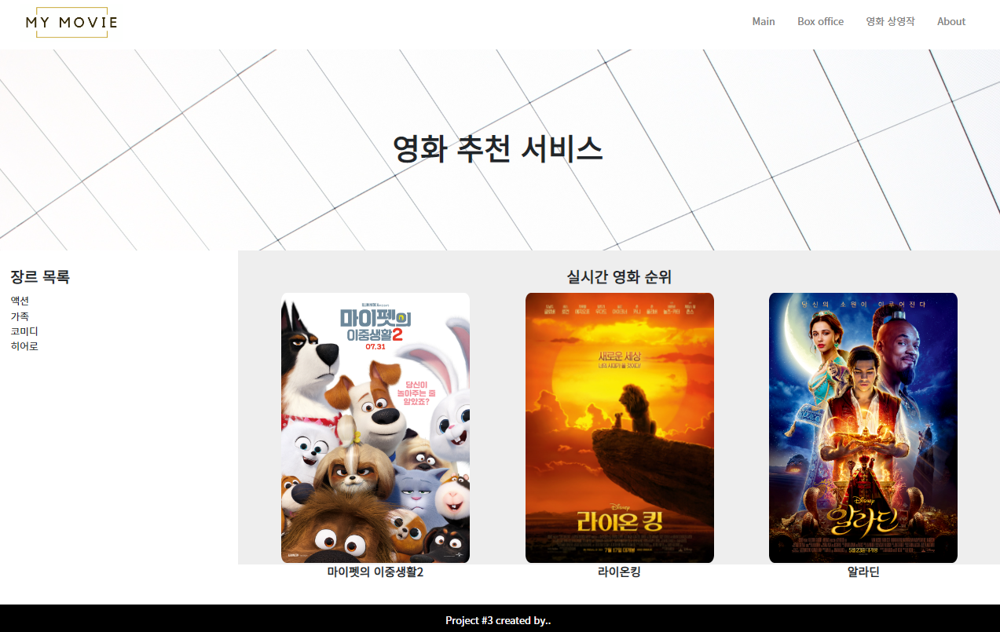

# web project 01

## 목표
- HTML를 통한 웹 페이지 마크업
- CSS를 통한 선택자 활용 및 속성 부여
- 시맨틱 태그를 활용한 기본 레이아웃 구성
- 영화 추천 사이트 메인 레이아웃 구성

## 준비 사항
1. **(필수)** HTML/CSS 환경 구성
2. **(필수)** 웹 페이지를 위한 Assets 다운로드
    - **`index.html`에 마크업을 작성하여 주세요.**
    - `reboot.css` 는 브라우저 기본 설정 CSS를 모두 동일하게 설정하기 위해 사용됩니다.        
    - `style.css` 에 스타일을 작성합니다.
    - `images` 폴더에는 활용할 포스터 이미지가 있습니다.

## 요구 사항
> HTML/CSS을 활용하여 목표로 하는 웹사이트의 레이아웃을 구성합니다. 아래의 필수 사항을 제외한 요소는 자유롭게 꾸며 주세요.

### **HTML 기초**

- `DOCTYPE`은 html입니다.
- `html`의 언어는 한국어(ko)입니다.
- `meta` 태그에 인코딩 설정을 UTF-8로 설정 해주세요.
- `meta` 태그에 기본 viewport 설정을 해주세요. (width: device-width, initial-scale: 1.0)
- `title` 태그는 영화 추천 사이트 라고 설정 해주세요.

### **`header`**

**웹 사이트의 헤더 부분에는 로고 이미지와 네비게이션 바를 구성합니다.**

- 속성
    - 헤더는 항상 상단에 유지 됩니다. **(sticky)**
    - 높이는 80px이며, 좌우 안쪽 여백(padding)은 40px입니다.
- 이미지 배치
    - 로고 이미지는 좌측에 배치합니다.
    - 로고 이미지의 높이는 60px입니다.
    - 로고 이미지는 `images/logo.png` 입니다.
- 네비게이션 바 (`nav`)
    - 네비게이션 바의 항목은 우측에 배치합니다.
    - 총 4개의 항목이 배치되며, 각각 임의의 링크(`#`) 으로 설정합니다.
        - 수직 정렬을 통해 중앙으로 일치시킵니다.

### **title `section`**

**서비스를 소개하는 문구와 배경 이미지가 있는 섹션을 구성합니다.**

- 속성
    - 높이는 320px이며, `header` 의 높이만큼 상단 여백을 설정합니다.
    - 수직 정렬을 통해 중앙으로 일치시킵니다.
    - 배경 이미지는 적절하게 삽입하고, 이미지에 맞게 사이즈와 위치를 조절 합니다.
    - `h1` 태그를 활용하여 사이트의 제목을 작성합니다.

👉 aside와 movie는 2:8의 비율을 가집니다.

### **`aside`**

**좌측 레이아웃에 장르 목록을 구성합니다.**

- 속성
    - 좌측에 위치합니다.
    - 상하좌우 안쪽 여백(padding)은 1rem입니다.
    - `h2` 태그를 활용하여 `장르 목록` 이라고 작성합니다.
    - 개별 장르는 `ul` 태그를 활용 하되 기본 안쪽 여백을 제거합니다.

### **movie `section`**

**우측 레이아웃에 제공된 영화 포스터를 활용하여 실시간 영화 순위 목록을 구성합니다.**

👉 먼저 3개를 한 줄로 배치하는 것만 진행하고, 추후에 6개로 늘려보세요.

- 속성
    - 우측에 위치하며, `aside` 를 제외한 모든 너비를 가집니다.
    - 상하좌우 안쪽 여백(padding)은 24px입니다.
    - 적절한 배경 색상을 적용 시킵니다.
    - `h2` 태그를 활용하여 `실시간 영화 순위` 라고 작성하며, 가운데 정렬을 합니다.
    - 영화는 한 행에 3개씩 배치하며, 각각 너비는 동일합니다.
    - 영화 이미지는 너비를 300px로 설정합니다.
    - 이미지 하단에는 영화명을 작성합니다.

### **`footer`**

**푸터를 구성합니다.**

- 속성
    - 푸터는 항상 하단에 유지 됩니다.
    - 높이는 40px이며, 모든 내용은 수직/수평 가운데 정렬을 합니다.
    - 적절한 배경 색상을 적용 시킵니다.

## 추가 구현 내용
- `a` 태그에 마우스 오버 시 색 변경
- 영화 이미지에 마우스 오버 시 영화 정보 나타내기
- `header`에 배경색 지정 후 스크롤 시 z-index를 1로 설정
- 글씨체 변경
- 영화 3개 더 추가
- `aside` 영역에 boder 추가

## 후기 ✨
페어프로그래밍으로 웹 프로젝트를 진행하면서 사람들과 소통하니 프로그래밍이 더 재밌었다.

서로의 가지고 있는 지식을 공유하며 문제를 해결해나가니 혼자 할때보다 더 쾌감이 있었다.

함께 한 짝이 단축키를 사용한 부분이나, 코드 작성에 쓰는 시간이 짧은 부분을 배우고 싶었다.

드라이버일때는 작은 목표를 해결하는데에 집중했고, 네비게이터일때는 더 넓은 시야로 설계하고, 구조에 대한 문제를 파악하는데 집중했다. 

이렇게 두가지 사고방식을 해서 내가 더 성장할 수 있는 시간이었기 때문에 기회가 되면 짝 프로그래밍을 또 하고 싶다는 생각이 들었다.

Image Hover Overlay 시에 패딩을 준 부분이 튀어나와서 이 부분을 배경색과 맞추는 방법을 써서 아쉽다.

이 부분 구현 방법을 더 연구해야겠다.