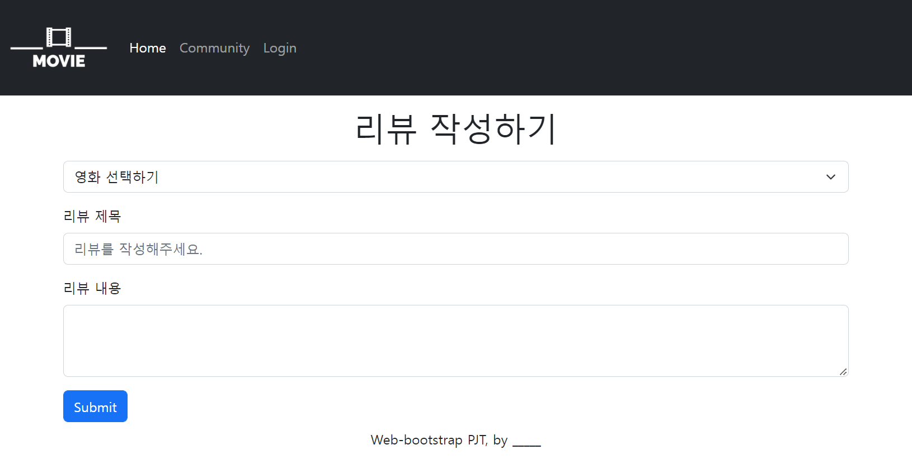
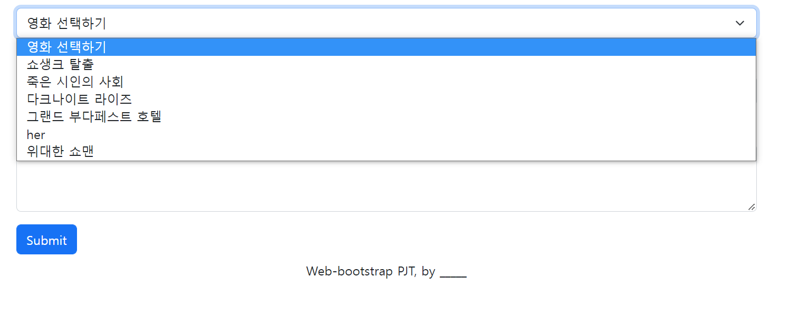
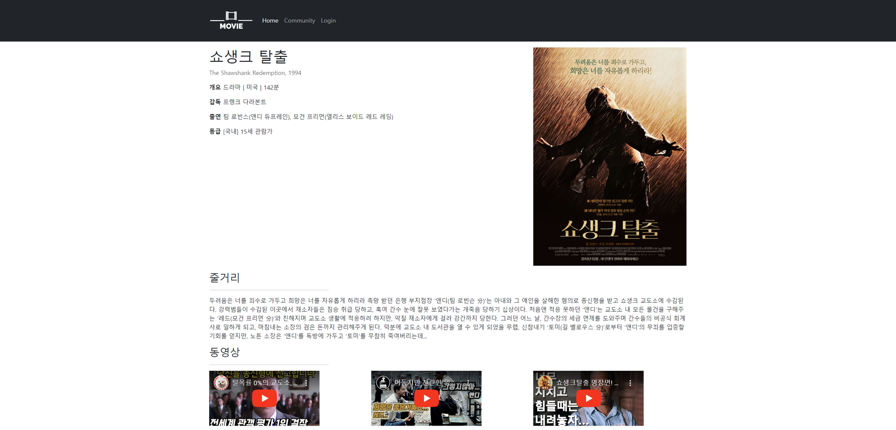
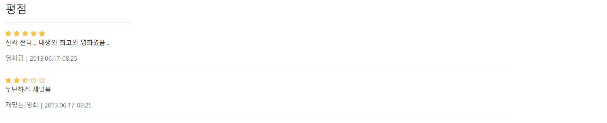

## 목표

- HTML를 통한 웹 페이지 마크업
- CSS를 통한 선택자 활용 및 속성 부여
- 시맨틱 태그를 활용한 기본 레이아웃 구성
- 영화 추천 사이트 메인 레이아웃 구성

## 준비 사항

1. **(필수)** HTML/CSS 환경 구성
2. **(필수)** Bootstrap

## 요구 사항

### 01_nav_footer.html

- navbar 좌측에는 영화 로고가 배치됩니다.
- 항목은 Home, Community, Login로 구성되어 있습니다.
    - Home은 02_home.html으로 링크를 구성합니다.
    - Community는 03_community.html으로 링크를 구성합니다.
    - Login은 Modal이 팝업됩니다.
        
        
        
- footer는 컨텐츠 최하단에 배치됩니다. 내용은 자유롭게 구성합니다.

### 02_home.html

- 01_nav_footer.html에서 작성한 Navigation bar & Modal & Footer 코드를 적절한 위치에 사용합니다.
- Carousel을 활용하여 이미지가 자동으로 전환될 수 있도록 합니다.
    - 이미지는 적절한 이미지를 찾아 변경 가능합니다.
- Boxoffice 문구는 `h2` 태그를 활용합니다.
- 영화 목록의 카드 배치는 반응형으로 합니다.
    - Viewport의 가로 크기가 576px 미만일 경우 한 행에 1개씩 표시됩니다.
        
        
        
    - Viewport의 가로 크기가 576px 이상일 경우 한 행에 2개 이상 표시됩니다.(자유롭게 설정 가능)
        
        
        
        
        

### 03_community.html

- 992px 이상
    
    
    
- 992px 미만
    
    
    
- 01_nav_footer.html에서 작성한 Navigation bar & Modal & Footer 코드를 적절한 위치에 사용합니다.
- Community 페이지는 크게 게시판 목록과 게시판으로 이루어져 있으며 반응형입니다.
- 게시판 목록(`aside`)은 클릭 가능하지만 연결된 링크는 없습니다.
    - Viewport의 가로 크기가 992px 미만일 경우 HTML main 요소 영역 전체만큼의 너비를 가집니다.
    - Viewport의 가로 크기가 992px 이상일 경우 HTML main 요소 영역 기준으로 좌측 1/6 만큼의 너비를 가집니다.
    - Viewport의 가로 크기 별 반응형 디자인은 스크린 샷 예시를 참고하여 일치하도록 합니다.
- Section (게시판)
    - 게시판은 Viewport의 가로 크기에 따라 전혀 다른 레이아웃으로 구성됩니다.
    - Viewport의 가로 크기가 992px 미만일 경우 게시판은 카드 형식으로 구성됩니다.
    - Viewport의 가로 크기가 992px 이상일 경우 테이블 형식으로 구성되며, HTML main 요소 영역 기준으로 우측 5/6 만큼의 너비를 가집니다.

### 04_form.html

- `03_community.html` 에서 글 작성하기 버튼을 적절한 위치에 만들고 누르면 해당 페이지로 이동합니다.
- 리뷰 작성을 위한 페이지를 자유롭게 설계하여 제작합니다.
- 예시

### 05_movie.html

- `02_home.html` 에서 쇼생크 탈출 카드를 누르면 해당 페이지로 이동합니다.
- 영화 상세 페이지를 자유롭게 설계하여 제작합니다.
- 참고
    - [https://movie.daum.net/moviedb/main?movieId=1368](https://movie.daum.net/moviedb/main?movieId=1368)
    - [https://movie.naver.com/movie/bi/mi/basic.naver?code=17421](https://movie.naver.com/movie/bi/mi/basic.naver?code=17421)
    - [https://www.themoviedb.org/movie/278-the-shawshank-redemption?language=ko](https://www.themoviedb.org/movie/278-the-shawshank-redemption?language=ko)
    - [https://www.wavve.com/player/movie?movieid=MV_CD01_WR0000011371](https://www.wavve.com/player/movie?movieid=MV_CD01_WR0000011371)
    - [https://watcha.com/ko-KR/contents/mNdKBkO](https://watcha.com/ko-KR/contents/mNdKBkO)
- 예시
    
    

    
    

### 사이트 추가 설정

- 웹 폰트를 적용 해봅니다.
- favicon을 적용 해봅니다.
- 완성된 페이지를 GitHub Pages를 통해 배포합니다.
    - GitHub Pages를 추가 활용하기 위해서 두가지 방법이 있습니다.
        - **필수: `02_home.html`을 `index.html`으로 변경할 것**
        1. 조직(Organization) 생성하기
            1. 예) fakewatcha 조직 생성 후 [fakewatcha.github.io](http://fakewatcha.github.io) 저장소를 만들어서 활용
        2. 별도의 저장소를 생성하기
            1. Settings > Pages 설정 가능한 옵션이 있습니다. 
- README에 개인 후기를 작성합니다.

<aside>
💡 2일간 작성한 코드 및 README 파일을 포함하여 Syllaverse 제출합니다.
GitHub Pages URL을 디스코드에 공유 해주세요 🙂

</aside>

### (개인 또는 팀) 자유 실습

- 위의 영화 사이트들을 참고하여 영화 목록 혹은 상세 페이지 등을 자유롭게 꾸며봅니다.

## 후기 ✨
- 페어 프로그래밍을 진행하면서 해결되지 않는 문제에 대해 짝과 함께 여러 방법을 모색하는 경험이 정말 좋았다. 네비게이터가 되어서 짝에게 구현 방법을 설명해 주면서 나의 지식을 더 견고히 하는 느낌을 받았다.
- 반응형 웹 서비스를 위해 `d-none`, `d-block`을 사용해서 레이아웃을 숨기고 나타내는 방법을 이번 프로젝트를 통해 알게 되었다. 이 클래스를 통해 더 다양한 프로젝트를 진행할 수 있을 거라고 기대된다.
- 이번 프로젝트를 진행하면서 grid system의 `row`, `col` 클래스에 대해 확실히 이해할 수 있었다. 반응형 웹 서비스를 만들 때 자유자제로 사용할 수 있을 거라는 확신이 들었다.
- 반응형 웹을 위해 다양한 형태로 연습할 수 있어서 좋았고, 향후 다른 웹 서비스를 만들 때도 많이 도움이 될 것 같다.
- 직접 github.io로 주소를 만들어서 나만의 영화 사이트 서비스가 만들어진 것이 정말 감격스럽다.